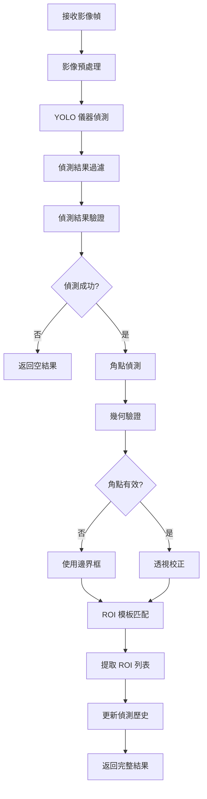

# DetectionAgent 設計文件

## 概述

DetectionAgent 是 MeterGPT 系統的偵測代理人，負責儀器偵測和角點偵測，包括透視校正和 ROI 提取。它是系統視覺處理的核心組件，將原始影像轉換為結構化的儀器資料。

## 核心職責

- **儀器偵測**：使用 YOLO 模型識別影像中的各種儀器類型
- **角點偵測**：精確定位儀器的四個角點座標
- **透視校正**：根據角點進行透視變換，獲得正視圖
- **ROI 提取**：根據儀器類型提取感興趣區域
- **幾何驗證**：驗證偵測結果的幾何合理性

## 系統架構

```
┌─────────────────────────────────────────────────────────────────┐
│                    DetectionAgent                               │
├─────────────────────────────────────────────────────────────────┤
│  ┌─────────────────┐  ┌─────────────────┐  ┌─────────────────┐  │
│  │ Instrument      │  │ Corner          │  │ ROI Extraction  │  │
│  │ Detection       │  │ Detection       │  │ Action          │  │
│  │ Action          │  │ Action          │  │                 │  │
│  └─────────────────┘  └─────────────────┘  └─────────────────┘  │
│  ┌─────────────────────────────────────────────────────────────┐  │
│  │                YOLO Model Manager                          │  │
│  │  ┌─────────────┐ ┌─────────────┐ ┌─────────────────────┐   │  │
│  │  │ Instrument  │ │ Corner      │ │ Template Matching   │   │  │
│  │  │ Detector    │ │ Detector    │ │ Engine              │   │  │
│  │  └─────────────┘ └─────────────┘ └─────────────────────┘   │  │
│  └─────────────────────────────────────────────────────────────┘  │
│  ┌─────────────────────────────────────────────────────────────┐  │
│  │              OpenCV Image Processor                        │  │
│  │  ┌─────────────┐ ┌─────────────┐ ┌─────────────────────┐   │  │
│  │  │ Perspective │ │ Geometry    │ │ ROI Template        │   │  │
│  │  │ Correction  │ │ Utils       │ │ Manager             │   │  │
│  │  └─────────────┘ └─────────────┘ └─────────────────────┘   │  │
│  └─────────────────────────────────────────────────────────────┘  │
└─────────────────────────────────────────────────────────────────┘
          │
          ▼ DetectionResult + ROIs
┌─────────────────────────────────────────────────────────────────┐
│              下游代理人 (OCRAgent)                               │
└─────────────────────────────────────────────────────────────────┘
```

## 核心功能

### 1. 儀器偵測 (InstrumentDetectionAction)

**功能描述**：
- 使用深度學習模型識別影像中的儀器
- 支援多種儀器類型的同時偵測
- 提供偵測信心度和邊界框資訊

**支援的儀器類型**：
```python
class InstrumentType(Enum):
    DIGITAL_DISPLAY = "digital_display"     # 數位顯示器
    SEVEN_SEGMENT = "seven_segment"         # 七段顯示器
    LCD_SCREEN = "lcd_screen"               # LCD 螢幕
    ANALOG_GAUGE = "analog_gauge"           # 類比儀表
    LED_DISPLAY = "led_display"             # LED 顯示器
    UNKNOWN = "unknown"                     # 未知類型
```

**輸入**：
- `StreamFrame`：待偵測的影像幀

**輸出**：
- `List[DetectionResult]`：偵測結果列表

**偵測流程**：
```python
async def detect_instruments(self, stream_frame: StreamFrame) -> List[DetectionResult]:
    # 1. 影像預處理
    enhanced_frame = image_processor.enhance_image(frame_array, "auto")
    
    # 2. YOLO 模型推理
    detections = self.instrument_detector.detect_instruments(enhanced_frame)
    
    # 3. 後處理和過濾
    filtered_detections = self._filter_detections(detections)
    
    # 4. 結果驗證
    validated_detections = self._validate_detections(filtered_detections)
    
    return validated_detections
```

### 2. 角點偵測 (CornerDetectionAction)

**功能描述**：
- 精確定位儀器的四個角點
- 支援深度學習和傳統方法的混合策略
- 提供幾何驗證確保角點合理性

**輸入**：
- `np.ndarray`：影像陣列
- `DetectionResult`：儀器偵測結果

**輸出**：
- `Optional[CornerPoints]`：角點座標

**角點偵測策略**：
```python
async def detect_corners(self, image: np.ndarray, detection_result: DetectionResult):
    # 策略 1: 深度學習角點偵測
    if self.corner_detector:
        corner_points = self.corner_detector.detect_corners(image, detection_result.bounding_box)
        
        # 驗證角點是否形成合理矩形
        if geometry_utils.is_rectangle(corner_points, tolerance=15.0):
            return corner_points
    
    # 策略 2: 傳統方法備援
    return self._detect_corners_traditional(image, detection_result.bounding_box)
```

**傳統角點偵測方法**：
```python
def _detect_corners_traditional(self, image: np.ndarray, bbox: BoundingBox) -> Optional[CornerPoints]:
    # 1. 提取 ROI
    roi = self._extract_roi_from_bbox(image, bbox)
    
    # 2. 邊緣檢測
    edges = cv2.Canny(roi, 50, 150)
    
    # 3. 輪廓檢測
    contours, _ = cv2.findContours(edges, cv2.RETR_EXTERNAL, cv2.CHAIN_APPROX_SIMPLE)
    
    # 4. 找到最大矩形輪廓
    largest_contour = max(contours, key=cv2.contourArea)
    
    # 5. 多邊形近似
    epsilon = 0.02 * cv2.arcLength(largest_contour, True)
    approx = cv2.approxPolyDP(largest_contour, epsilon, True)
    
    # 6. 驗證是否為四邊形
    if len(approx) == 4:
        return self._create_corner_points(approx, bbox)
    
    return None
```

### 3. ROI 提取 (ROIExtractionAction)

**功能描述**：
- 根據儀器類型和角點資訊提取感興趣區域
- 執行透視校正獲得正視圖
- 應用儀器模板進行精確 ROI 定位

**輸入**：
- `np.ndarray`：影像陣列
- `DetectionResult`：儀器偵測結果
- `Optional[CornerPoints]`：角點座標

**輸出**：
- `List[ROI]`：ROI 列表

**ROI 提取流程**：
```python
async def extract_rois(self, image: np.ndarray, detection_result: DetectionResult, 
                      corner_points: Optional[CornerPoints]) -> List[ROI]:
    # 1. 透視校正 (如果有角點)
    if corner_points:
        corrected_image = image_processor.perspective_correction(image, corner_points)
    else:
        # 直接裁切儀器區域
        bbox = detection_result.bounding_box
        corrected_image = image[bbox.y:bbox.y+bbox.height, bbox.x:bbox.x+bbox.width]
    
    # 2. 取得儀器模板配置
    template_config = self._get_template_config(detection_result.instrument_type)
    
    # 3. 應用模板提取 ROI
    rois = image_processor.extract_rois(corrected_image, template_config)
    
    return rois
```

## 工作流程



## 資料格式

### 輸入資料格式

#### StreamFrame
```python
@dataclass
class StreamFrame:
    frame_id: str
    camera_info: CameraInfo
    frame_data: bytes           # JPEG 編碼的影像資料
    frame_shape: Tuple[int, int, int]
    timestamp: datetime
    metadata: Dict[str, Any]
```

### 輸出資料格式

#### DetectionResult
```python
@dataclass
class DetectionResult:
    frame_id: str               # 影像幀識別碼
    instrument_type: InstrumentType  # 儀器類型
    bounding_box: BoundingBox   # 邊界框
    confidence: float           # 偵測信心度 (0.0-1.0)
    timestamp: datetime         # 偵測時間戳
    metadata: Dict[str, Any]    # 額外元資料
```

#### CornerPoints
```python
@dataclass
class CornerPoints:
    top_left: Tuple[float, float]      # 左上角座標
    top_right: Tuple[float, float]     # 右上角座標
    bottom_right: Tuple[float, float]  # 右下角座標
    bottom_left: Tuple[float, float]   # 左下角座標
    confidence: float                  # 角點偵測信心度
    detection_method: str              # 偵測方法 ("dl" 或 "traditional")
```

#### ROI
```python
@dataclass
class ROI:
    roi_id: str                 # ROI 唯一識別碼
    field_name: str             # 欄位名稱 (如 "main_display")
    bounding_box: BoundingBox   # ROI 邊界框
    image_data: bytes           # ROI 影像資料
    expected_format: str        # 預期格式 ("text", "number", "seven_segment")
    confidence: float           # ROI 品質信心度
    metadata: Dict[str, Any]    # 額外元資料
```

## 與其他代理人的協作關係

### 上游依賴
- **QualityAssessor**：只處理通過品質檢查的影像
- **StreamManager**：接收高品質的影像幀
- **配置系統**：取得模型路徑和偵測參數

### 下游服務
- **OCRAgent**：提供結構化的 ROI 供文字識別
- **FallbackAgent**：偵測失敗時觸發備援機制

### 協作流程
1. **接收階段**：從 QualityAssessor 接收高品質影像
2. **偵測階段**：執行儀器和角點偵測
3. **提取階段**：生成結構化的 ROI 資料
4. **傳遞階段**：將 ROI 傳遞給 OCRAgent

## 配置參數

### 模型配置
```yaml
detection_model:
  model_name: "instrument_detector_v2"
  model_path: "./models/instrument_yolo.pt"
  model_type: "detection"
  device: "cuda"                    # "cuda" 或 "cpu"
  confidence_threshold: 0.7         # 偵測信心度閾值
  nms_threshold: 0.5               # 非極大值抑制閾值
  max_detections: 10               # 最大偵測數量

corner_detection_model:
  model_name: "corner_detector_v1"
  model_path: "./models/corner_yolo.pt"
  model_type: "corner_detection"
  device: "cuda"
  confidence_threshold: 0.8
  fallback_to_traditional: true    # 啟用傳統方法備援
```

### 儀器模板配置
```yaml
instrument_templates:
  digital_display:
    rois:
      - field_name: "main_display"
        bbox: {x: 10, y: 10, width: 200, height: 80}
        expected_format: "text"
      - field_name: "unit_display"
        bbox: {x: 220, y: 10, width: 50, height: 30}
        expected_format: "text"
  
  seven_segment:
    rois:
      - field_name: "seven_segment_display"
        bbox: {x: 5, y: 5, width: 150, height: 60}
        expected_format: "seven_segment"
  
  analog_gauge:
    rois:
      - field_name: "gauge_reading"
        bbox: {x: 20, y: 20, width: 160, height: 160}
        expected_format: "analog"
```

### 處理參數
```yaml
detection_processing:
  image_enhancement:
    enabled: true
    method: "auto"                  # "auto", "clahe", "gamma"
    
  geometric_validation:
    enabled: true
    min_area: 1000                  # 最小儀器面積
    max_aspect_ratio: 5.0           # 最大長寬比
    corner_tolerance: 15.0          # 角點幾何容忍度
    
  roi_extraction:
    perspective_correction: true
    template_matching_threshold: 0.8
    adaptive_templates: true
```

## 錯誤處理機制

### 1. 模型載入失敗
```python
def _handle_model_load_failure(self, model_type: str, error: Exception):
    """處理模型載入失敗"""
    self.logger.error(f"{model_type} 模型載入失敗: {error}")
    
    if model_type == "instrument_detector":
        # 嘗試載入備用模型
        backup_model_path = self.config.backup_detection_model_path
        if backup_model_path:
            self.instrument_detector = self._load_backup_model(backup_model_path)
        else:
            raise RuntimeError("主要和備用偵測模型都無法載入")
    
    elif model_type == "corner_detector":
        # 角點偵測失敗時使用傳統方法
        self.logger.warning("將使用傳統角點偵測方法")
        self.corner_detector = None
```

### 2. 偵測結果驗證
```python
def _validate_detection_result(self, detection: DetectionResult) -> bool:
    """驗證偵測結果"""
    # 檢查信心度
    if detection.confidence < self.config.detection_model.confidence_threshold:
        return False
    
    # 檢查邊界框合理性
    bbox = detection.bounding_box
    if bbox.width < 50 or bbox.height < 50:  # 最小尺寸檢查
        return False
    
    if bbox.width / bbox.height > 10 or bbox.height / bbox.width > 10:  # 長寬比檢查
        return False
    
    return True
```

### 3. 角點幾何驗證
```python
def _validate_corner_geometry(self, corners: CornerPoints) -> bool:
    """驗證角點幾何合理性"""
    points = [corners.top_left, corners.top_right, 
              corners.bottom_right, corners.bottom_left]
    
    # 檢查是否形成凸四邊形
    if not geometry_utils.is_convex_quadrilateral(points):
        return False
    
    # 檢查角度合理性
    angles = geometry_utils.calculate_angles(points)
    if any(angle < 30 or angle > 150 for angle in angles):
        return False
    
    return True
```

## 效能考量

### 1. 模型推理最佳化
```python
class ModelInferenceOptimizer:
    def __init__(self):
        self.batch_size = 4
        self.use_tensorrt = True
        self.use_half_precision = True
    
    def optimize_model(self, model):
        """最佳化模型推理"""
        if self.use_tensorrt:
            model = self._convert_to_tensorrt(model)
        
        if self.use_half_precision:
            model = model.half()
        
        return model
    
    async def batch_inference(self, images: List[np.ndarray]):
        """批次推理"""
        batches = self._create_batches(images, self.batch_size)
        results = []
        
        for batch in batches:
            batch_results = await self._infer_batch(batch)
            results.extend(batch_results)
        
        return results
```

### 2. 記憶體管理
```python
def _manage_memory_usage(self):
    """管理記憶體使用"""
    # 限制歷史記錄大小
    for camera_id in self.detection_history:
        if len(self.detection_history[camera_id]) > self.max_history_size:
            self.detection_history[camera_id] = self.detection_history[camera_id][-self.max_history_size:]
    
    # 清理暫存影像
    self._clear_temp_images()
    
    # 強制垃圾回收
    import gc
    gc.collect()
```

### 3. 並行處理
```python
async def parallel_detection_pipeline(self, stream_frame: StreamFrame):
    """並行偵測管線"""
    # 同時執行儀器偵測和影像預處理
    detection_task = asyncio.create_task(self._detect_instruments(stream_frame))
    preprocessing_task = asyncio.create_task(self._preprocess_for_corners(stream_frame))
    
    detection_results, preprocessed_image = await asyncio.gather(
        detection_task, preprocessing_task
    )
    
    # 並行處理每個偵測到的儀器
    corner_tasks = [
        self._detect_corners(preprocessed_image, detection)
        for detection in detection_results
    ]
    
    corner_results = await asyncio.gather(*corner_tasks)
    
    return list(zip(detection_results, corner_results))
```

## 監控指標

### 關鍵效能指標 (KPI)
```python
{
    "detection_rate": 25.3,         # 每秒偵測幀數
    "detection_accuracy": 0.92,     # 偵測準確率
    "corner_detection_rate": 0.85,  # 角點偵測成功率
    "roi_extraction_rate": 0.95,    # ROI 提取成功率
    "average_processing_time": 120, # 平均處理時間 (ms)
    "model_inference_time": 45,     # 模型推理時間 (ms)
    "geometric_validation_rate": 0.88  # 幾何驗證通過率
}
```

### 偵測統計
```python
{
    "instrument_type_distribution": {
        "digital_display": 0.45,
        "seven_segment": 0.30,
        "lcd_screen": 0.15,
        "analog_gauge": 0.08,
        "unknown": 0.02
    },
    "confidence_distribution": {
        "high": 0.70,      # > 0.8
        "medium": 0.25,    # 0.6-0.8
        "low": 0.05        # < 0.6
    },
    "failure_reasons": {
        "low_confidence": 0.08,
        "geometric_invalid": 0.03,
        "corner_detection_failed": 0.05,
        "roi_extraction_failed": 0.02
    }
}
```

## 使用範例

### 基本使用
```python
from meter_gpt.agents.detection_agent import DetectionAgent

# 初始化偵測代理人
detection_agent = DetectionAgent()

# 執行完整偵測流程
results = await detection_agent.detect_and_extract(stream_frame)

for result in results:
    detection = result['detection_result']
    corners = result['corner_points']
    rois = result['rois']
    
    print(f"偵測到儀器: {detection.instrument_type.value}")
    print(f"信心度: {detection.confidence:.3f}")
    print(f"角點偵測: {'成功' if corners else '失敗'}")
    print(f"提取 ROI 數量: {len(rois)}")
```

### 單步驟使用
```python
# 僅執行儀器偵測
instrument_action = InstrumentDetectionAction()
detections = await instrument_action.run(stream_frame)

# 僅執行角點偵測
corner_action = CornerDetectionAction()
corners = await corner_action.run(image_array, detections[0])

# 僅執行 ROI 提取
roi_action = ROIExtractionAction()
rois = await roi_action.run(image_array, detections[0], corners)
```

### 批次處理
```python
# 批次處理多個影像幀
stream_frames = [frame1, frame2, frame3]
all_results = []

for frame in stream_frames:
    results = await detection_agent.detect_and_extract(frame)
    all_results.extend(results)

# 統計結果
total_detections = len(all_results)
successful_detections = len([r for r in all_results if r['processing_success']])
success_rate = successful_detections / total_detections

print(f"偵測成功率: {success_rate:.2%}")
```

### 效能監控
```python
# 取得偵測統計
stats = detection_agent.get_detection_statistics("cam_001")
print(f"總偵測次數: {stats['total_detections']}")
print(f"平均信心度: {stats['average_confidence']:.3f}")

# 取得偵測摘要
summary = await detection_agent.get_detection_summary()
print(f"活躍攝影機數: {summary['active_cameras']}")
print(f"整體偵測率: {summary['overall_detection_rate']:.3f}")
```

## 故障排除

### 常見問題

1. **偵測準確率低**
   - 檢查模型版本和訓練資料
   - 調整信心度閾值
   - 改善影像前處理

2. **角點偵測失敗率高**
   - 啟用傳統方法備援
   - 調整幾何驗證參數
   - 檢查攝影機角度和距離

3. **ROI 提取不準確**
   - 更新儀器模板配置
   - 檢查透視校正效果
   - 驗證角點偵測品質

### 除錯工具
```python
# 啟用視覺化除錯
detection_agent.enable_debug_visualization()

# 匯出偵測結果
detection_agent.export_detection_results("cam_001", format="json")

# 視覺化偵測過程
detection_agent.visualize_detection_pipeline(stream_frame, save_path="debug/")
```

## 未來擴展

### 計劃功能
- **多尺度偵測**：支援不同尺寸的儀器偵測
- **3D 姿態估計**：估計儀器的 3D 姿態和方向
- **動態模板**：根據偵測結果動態調整 ROI 模板
- **增量學習**：在線學習新的儀器類型

### 技術改進
- **Transformer 架構**：使用 Vision Transformer 提升偵測精度
- **端到端訓練**：整合偵測和角點偵測的端到端模型
- **自監督學習**：利用時序資訊進行自監督學習
- **邊緣最佳化**：針對邊緣設備的模型壓縮和加速