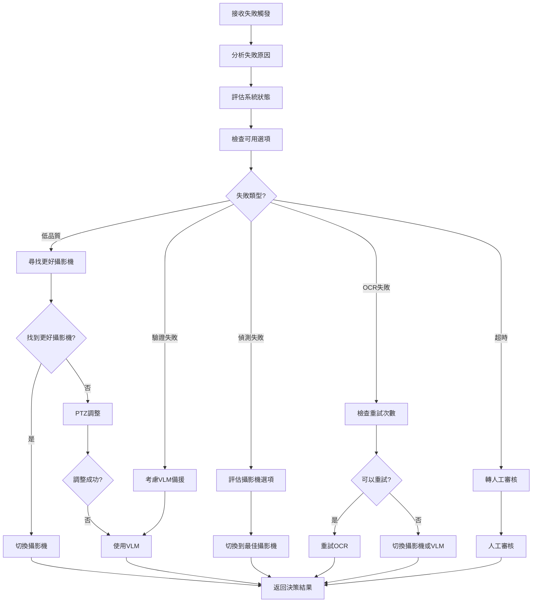

# FallbackAgent 設計文件

## 概述

FallbackAgent 是 MeterGPT 系統的備援代理人，負責備援決策邏輯，當主要流程失敗時提供智慧備援方案。它是系統可靠性和容錯能力的關鍵組件，確保在各種異常情況下系統仍能提供有效的服務。

## 核心職責

- **備援決策**：分析失敗原因並制定最適合的備援策略
- **攝影機切換**：智慧選擇和切換到品質更好的備援攝影機
- **VLM 備援**：使用視覺語言模型作為最後的識別手段
- **PTZ 控制**：調整攝影機的平移、傾斜和縮放參數
- **人工審核**：將複雜案例轉交人工處理

## 系統架構

```
┌─────────────────────────────────────────────────────────────────┐
│                    FallbackAgent                               │
├─────────────────────────────────────────────────────────────────┤
│  ┌─────────────────┐  ┌─────────────────┐  ┌─────────────────┐  │
│  │ Fallback        │  │ VLM Fallback    │  │ PTZ Control     │  │
│  │ Decision        │  │ Action          │  │ Action          │  │
│  │ Action          │  │                 │  │                 │  │
│  └─────────────────┘  └─────────────────┘  └─────────────────┘  │
│  ┌─────────────────────────────────────────────────────────────┐  │
│  │              Decision Engine                               │  │
│  │  ┌─────────────┐ ┌─────────────┐ ┌─────────────────────┐   │  │
│  │  │ Failure     │ │ Strategy    │ │ Camera Quality      │   │  │
│  │  │ Analysis    │ │ Selection   │ │ Evaluator           │   │  │
│  │  └─────────────┘ └─────────────┘ └─────────────────────┘   │  │
│  └─────────────────────────────────────────────────────────────┘  │
│  ┌─────────────────────────────────────────────────────────────┐  │
│  │              External Integrations                        │  │
│  │  ┌─────────────┐ ┌─────────────┐ ┌─────────────────────┐   │  │
│  │  │ VLM API     │ │ PTZ Camera  │ │ Human Review        │   │  │
│  │  │ Client      │ │ Controller  │ │ Interface           │   │  │
│  │  └─────────────┘ └─────────────┘ └─────────────────────┘   │  │
│  └─────────────────────────────────────────────────────────────┘  │
└─────────────────────────────────────────────────────────────────┘
          │
          ▼ FallbackDecision
┌─────────────────────────────────────────────────────────────────┐
│              上游代理人 (Orchestrator)                           │
└─────────────────────────────────────────────────────────────────┘
```

## 核心功能

### 1. 備援決策引擎 (FallbackDecisionAction)

**功能描述**：
- 分析失敗觸發條件和上下文
- 評估可用的備援選項
- 制定最優的備援策略

**觸發條件**：
```python
class FallbackTrigger(Enum):
    LOW_QUALITY = "low_quality"           # 影像品質不佳
    DETECTION_FAILED = "detection_failed" # 儀器偵測失敗
    OCR_FAILED = "ocr_failed"            # OCR 識別失敗
    VALIDATION_FAILED = "validation_failed" # 驗證失敗
    TIMEOUT = "timeout"                   # 處理超時
    MANUAL_REQUEST = "manual_request"     # 手動請求
```

**備援動作**：
```python
class FallbackAction(Enum):
    SWITCH_CAMERA = "switch_camera"       # 切換攝影機
    USE_VLM = "use_vlm"                  # 使用 VLM
    ADJUST_PTZ = "adjust_ptz"            # 調整 PTZ
    RETRY_OCR = "retry_ocr"              # 重試 OCR
    MANUAL_REVIEW = "manual_review"       # 人工審核
```

**決策流程**：
```python
async def make_fallback_decision(self, trigger: FallbackTrigger, 
                               context: Dict[str, Any]) -> FallbackDecision:
    """制定備援決策"""
    # 1. 分析失敗原因
    failure_analysis = self._analyze_failure_cause(trigger, context)
    
    # 2. 評估可用選項
    available_options = self._evaluate_available_options(context)
    
    # 3. 選擇最佳策略
    recommended_action = self._select_optimal_strategy(
        trigger, failure_analysis, available_options
    )
    
    # 4. 確定備援攝影機 (如需要)
    alternative_camera = None
    if recommended_action == FallbackAction.SWITCH_CAMERA:
        alternative_camera = self._find_best_alternative_camera(context)
    
    # 5. 建立決策結果
    return FallbackDecision(
        frame_id=context.get('frame_id'),
        trigger_reason=self._map_trigger_to_failure_type(trigger),
        recommended_action=recommended_action,
        alternative_camera_id=alternative_camera,
        confidence_threshold=self._calculate_confidence_threshold(trigger),
        max_retries=self._get_max_retries(trigger),
        priority=self._calculate_priority(trigger, context)
    )
```

### 2. VLM 備援處理 (VLMFallbackAction)

**功能描述**：
- 使用視覺語言模型進行影像識別
- 提供自然語言提示詞最佳化
- 處理 VLM API 調用和結果解析

**支援的 VLM 模型**：
- GPT-4 Vision
- Claude 3 Vision
- Gemini Pro Vision
- 自定義 VLM 模型

**VLM 處理流程**：
```python
async def execute_vlm_fallback(self, image_data: bytes, frame_id: str,
                              prompt: str = None) -> VLMResponse:
    """執行 VLM 備援識別"""
    # 1. 準備請求
    request_id = f"vlm_{frame_id}_{datetime.now().strftime('%Y%m%d_%H%M%S')}"
    
    # 2. 最佳化提示詞
    if not prompt:
        prompt = self._generate_optimal_prompt(image_data)
    
    # 3. 建立 VLM 請求
    vlm_request = VLMRequest(
        request_id=request_id,
        frame_id=frame_id,
        image_data=image_data,
        prompt=prompt,
        max_tokens=self.config.vlm.max_tokens,
        temperature=self.config.vlm.temperature
    )
    
    # 4. 調用 VLM API
    vlm_response = await self._call_vlm_api(vlm_request)
    
    # 5. 後處理結果
    processed_response = self._post_process_vlm_response(vlm_response)
    
    return processed_response
```

**智慧提示詞生成**：
```python
def _generate_optimal_prompt(self, image_data: bytes, context: Dict = None) -> str:
    """生成最佳化的提示詞"""
    base_prompt = "請仔細觀察這個儀器顯示器，識別其中顯示的數字或文字。"
    
    # 根據上下文調整提示詞
    if context:
        instrument_type = context.get('instrument_type')
        if instrument_type == 'seven_segment':
            base_prompt += "這是一個七段顯示器，請識別顯示的數字。"
        elif instrument_type == 'digital_display':
            base_prompt += "這是一個數位顯示器，請識別顯示的完整讀值。"
        elif instrument_type == 'analog_gauge':
            base_prompt += "這是一個類比儀表，請讀取指針指向的數值。"
    
    base_prompt += "只回答看到的數值，不要包含其他說明或推測。如果無法清楚識別，請回答 'UNCLEAR'。"
    
    return base_prompt
```

### 3. PTZ 控制 (PTZControlAction)

**功能描述**：
- 控制攝影機的平移、傾斜和縮放
- 執行自動掃描和對焦
- 最佳化攝影機位置和角度

**PTZ 控制類型**：
```python
PTZ_CONTROL_TYPES = {
    "scan": "掃描模式 - 自動尋找最佳角度",
    "focus": "對焦模式 - 調整焦距獲得清晰影像",
    "position": "位置模式 - 調整到預設位置",
    "zoom": "縮放模式 - 調整縮放比例",
    "auto": "自動模式 - 綜合調整所有參數"
}
```

**PTZ 控制流程**：
```python
async def execute_ptz_adjustment(self, camera_id: str, 
                                adjustment_type: str = "auto") -> Dict[str, Any]:
    """執行 PTZ 調整"""
    # 1. 檢查 PTZ 支援
    if not self._is_ptz_supported(camera_id):
        return {
            "success": False,
            "message": f"攝影機 {camera_id} 不支援 PTZ 控制"
        }
    
    # 2. 取得當前位置
    current_position = await self._get_current_ptz_position(camera_id)
    
    # 3. 計算最佳調整
    optimal_adjustment = self._calculate_optimal_adjustment(
        camera_id, adjustment_type, current_position
    )
    
    # 4. 執行調整
    adjustment_result = await self._execute_ptz_command(
        camera_id, optimal_adjustment
    )
    
    # 5. 驗證調整效果
    verification_result = await self._verify_adjustment_effect(camera_id)
    
    return {
        "success": adjustment_result["success"],
        "message": adjustment_result["message"],
        "new_position": adjustment_result.get("new_position"),
        "improvement_score": verification_result.get("improvement_score", 0.0)
    }
```

## 決策策略

### 1. 低品質處理策略
```python
async def _handle_low_quality(self, current_camera_id: str, 
                             available_cameras: List[str], 
                             quality_scores: Dict[str, float]) -> Tuple[FallbackAction, Optional[str]]:
    """處理低品質情況"""
    # 策略 1: 尋找品質更好的攝影機
    best_camera = self._find_best_quality_camera(
        available_cameras, quality_scores, current_camera_id
    )
    
    if best_camera and quality_scores[best_camera] > quality_scores[current_camera_id] + 0.2:
        return FallbackAction.SWITCH_CAMERA, best_camera
    
    # 策略 2: PTZ 調整
    if self.config.fallback.ptz_adjustment_enabled:
        return FallbackAction.ADJUST_PTZ, current_camera_id
    
    # 策略 3: VLM 備援
    return FallbackAction.USE_VLM, None
```

### 2. 偵測失敗處理策略
```python
async def _handle_detection_failure(self, current_camera_id: str,
                                   available_cameras: List[str],
                                   quality_scores: Dict[str, float]) -> Tuple[FallbackAction, Optional[str]]:
    """處理偵測失敗情況"""
    # 優先切換攝影機
    best_camera = self._find_best_quality_camera(
        available_cameras, quality_scores, current_camera_id
    )
    
    if best_camera:
        return FallbackAction.SWITCH_CAMERA, best_camera
    
    # 使用 VLM 作為備援
    return FallbackAction.USE_VLM, None
```

### 3. OCR 失敗處理策略
```python
async def _handle_ocr_failure(self, current_camera_id: str,
                             available_cameras: List[str],
                             quality_scores: Dict[str, float],
                             retry_count: int, max_retries: int) -> Tuple[FallbackAction, Optional[str]]:
    """處理 OCR 失敗情況"""
    # 如果重試次數未達上限，先重試
    if retry_count < max_retries:
        return FallbackAction.RETRY_OCR, None
    
    # 嘗試切換攝影機
    best_camera = self._find_best_quality_camera(
        available_cameras, quality_scores, current_camera_id
    )
    
    if best_camera:
        return FallbackAction.SWITCH_CAMERA, best_camera
    
    # 使用 VLM
    return FallbackAction.USE_VLM, None
```

## 工作流程



## 資料格式

### 輸入資料格式

#### 觸發上下文
```python
@dataclass
class FallbackContext:
    frame_id: str                       # 影像幀識別碼
    camera_id: str                      # 當前攝影機 ID
    available_cameras: List[str]        # 可用攝影機列表
    quality_scores: Dict[str, float]    # 各攝影機品質分數
    retry_count: int                    # 重試次數
    failure_details: Dict[str, Any]     # 失敗詳細資訊
    system_status: Dict[str, Any]       # 系統狀態
```

### 輸出資料格式

#### FallbackDecision
```python
@dataclass
class FallbackDecision:
    frame_id: str                       # 影像幀識別碼
    trigger_reason: FailureType         # 觸發原因
    recommended_action: FallbackAction  # 建議動作
    alternative_camera_id: Optional[str] # 備選攝影機 ID
    confidence_threshold: float         # 信心度閾值
    max_retries: int                    # 最大重試次數
    priority: int                       # 優先級
    timestamp: datetime                 # 決策時間戳
    metadata: Dict[str, Any]            # 額外元資料
```

#### VLMResponse
```python
@dataclass
class VLMResponse:
    request_id: str                     # 請求識別碼
    response_text: str                  # VLM 回應文字
    confidence: float                   # 回應信心度
    processing_time: float              # 處理時間
    model_name: str                     # 使用的模型名稱
    token_usage: Dict[str, int]         # Token 使用統計
    timestamp: datetime                 # 回應時間戳
    metadata: Dict[str, Any]            # 額外元資料
```

## 與其他代理人的協作關係

### 上游依賴
- **Orchestrator**：接收失敗通知和上下文資訊
- **QualityAssessor**：取得攝影機品質評估資料
- **StreamManager**：取得攝影機狀態和切換控制

### 下游服務
- **Orchestrator**：提供備援決策和執行結果
- **外部系統**：VLM API、PTZ 控制器、人工審核介面

### 協作流程
1. **觸發階段**：從 Orchestrator 接收失敗通知
2. **分析階段**：分析失敗原因和系統狀態
3. **決策階段**：制定最優備援策略
4. **執行階段**：執行備援動作
5. **回饋階段**：向 Orchestrator 回報執行結果

## 配置參數

### 備援策略配置
```yaml
fallback:
  # 攝影機切換
  camera_switch:
    enabled: true
    quality_threshold: 0.4          # 品質閾值
    min_improvement: 0.2            # 最小改善幅度
    switch_timeout: 10              # 切換超時時間
    
  # VLM 備援
  vlm:
    enabled: true
    model_name: "gpt-4-vision-preview"
    api_endpoint: "https://api.openai.com/v1"
    max_tokens: 500
    temperature: 0.1
    timeout: 30
    confidence_threshold: 0.7
    
  # PTZ 控制
  ptz:
    enabled: true
    adjustment_timeout: 15          # 調整超時時間
    verification_delay: 3           # 驗證延遲時間
    max_adjustment_attempts: 3      # 最大調整嘗試次數
    
  # 重試策略
  retry:
    max_retries: 3                  # 最大重試次數
    retry_delay: 2                  # 重試延遲時間
    exponential_backoff: true       # 指數退避
    
  # 人工審核
  manual_review:
    enabled: true
    queue_size: 100                 # 審核佇列大小
    timeout: 300                    # 審核超時時間
```

### 決策參數
```yaml
decision_engine:
  # 優先級設定
  priority_weights:
    timeout: 1                      # 超時 (最高優先級)
    detection_failed: 2
    ocr_failed: 3
    validation_failed: 4
    low_quality: 5
    manual_request: 6
    
  # 策略選擇
  strategy_selection:
    prefer_camera_switch: true      # 優先攝影機切換
    vlm_as_last_resort: true       # VLM 作為最後手段
    enable_ptz_adjustment: true     # 啟用 PTZ 調整
    
  # 閾值設定
  thresholds:
    quality_improvement: 0.2        # 品質改善閾值
    confidence_degradation: 0.1     # 信心度降級閾值
    retry_confidence: 0.5           # 重試信心度閾值
```

## 錯誤處理機制

### 1. VLM API 失敗處理
```python
async def _handle_vlm_api_failure(self, request: VLMRequest, 
                                 error: Exception) -> VLMResponse:
    """處理 VLM API 失敗"""
    self.logger.error(f"VLM API 調用失敗: {error}")
    
    # 嘗試備用 VLM 服務
    for backup_service in self.config.vlm.backup_services:
        try:
            return await self._call_backup_vlm_service(backup_service, request)
        except Exception as backup_error:
            self.logger.warning(f"備用 VLM 服務 {backup_service} 也失敗: {backup_error}")
    
    # 所有 VLM 服務都失敗，返回錯誤回應
    return VLMResponse(
        request_id=request.request_id,
        response_text="",
        confidence=0.0,
        processing_time=0.0,
        model_name="error",
        token_usage={},
        metadata={"error": str(error)}
    )
```

### 2. PTZ 控制失敗處理
```python
async def _handle_ptz_control_failure(self, camera_id: str, 
                                     error: Exception) -> Dict[str, Any]:
    """處理 PTZ 控制失敗"""
    self.logger.error(f"PTZ 控制失敗 {camera_id}: {error}")
    
    # 嘗試重置 PTZ 位置
    try:
        await self._reset_ptz_position(camera_id)
        return {
            "success": False,
            "message": f"PTZ 控制失敗，已重置位置: {str(error)}",
            "recovery_attempted": True
        }
    except Exception as reset_error:
        return {
            "success": False,
            "message": f"PTZ 控制和重置都失敗: {str(error)}",
            "recovery_attempted": False
        }
```

### 3. 攝影機切換失敗處理
```python
async def _handle_camera_switch_failure(self, target_camera_id: str,
                                       error: Exception) -> Dict[str, Any]:
    """處理攝影機切換失敗"""
    self.logger.error(f"攝影機切換失敗 {target_camera_id}: {error}")
    
    # 標記攝影機為不可用
    await self._mark_camera_unavailable(target_camera_id)
    
    # 尋找其他可用攝影機
    alternative_cameras = await self._find_alternative_cameras(target_camera_id)
    
    return {
        "success": False,
        "message": f"攝影機切換失敗: {str(error)}",
        "alternative_cameras": alternative_cameras,
        "camera_marked_unavailable": True
    }
```

## 效能考量

### 1. 決策速度最佳化
```python
class FastDecisionEngine:
    def __init__(self):
        self.decision_cache = {}
        self.strategy_templates = self._load_strategy_templates()
    
    async def make_fast_decision(self, trigger: FallbackTrigger, 
                               context: Dict[str, Any]) -> FallbackDecision:
        """快速決策"""
        # 1. 檢查快取
        cache_key = self._generate_cache_key(trigger, context)
        if cache_key in self.decision_cache:
            cached_decision = self.decision_cache[cache_key]
            if self._is_cache_valid(cached_decision):
                return cached_decision
        
        # 2. 使用策略模板
        template = self.strategy_templates.get(trigger)
        if template:
            decision = self._apply_strategy_template(template, context)
        else:
            decision = await self._full_decision_analysis(trigger, context)
        
        # 3. 更新快取
        self.decision_cache[cache_key] = decision
        
        return decision
```

### 2. VLM 調用最佳化
```python
class VLMOptimizer:
    def __init__(self):
        self.request_queue = asyncio.Queue()
        self.batch_processor = None
        self.response_cache = {}
    
    async def optimized_vlm_call(self, request: VLMRequest) -> VLMResponse:
        """最佳化的 VLM 調用"""
        # 1. 檢查快取
        cache_key = self._generate_image_hash(request.image_data)
        if cache_key in self.response_cache:
            return self.response_cache[cache_key]
        
        # 2. 批次處理
        if self.config.vlm.enable_batching:
            return await self._batch_process_request(request)
        
        # 3. 直接調用
        response = await self._direct_vlm_call(request)
        
        # 4. 更新快取
        self.response_cache[cache_key] = response
        
        return response
```

### 3. 資源管理
```python
class ResourceManager:
    def __init__(self):
        self.active_operations = {}
        self.resource_limits = {
            "max_concurrent_vlm_calls": 3,
            "max_concurrent_ptz_operations": 2,
            "max_camera_switches_per_minute": 5
        }
    
    async def acquire_resource(self, resource_type: str, operation_id: str) -> bool:
        """取得資源"""
        current_count = len([
            op for op in self.active_operations.values() 
            if op["type"] == resource_type
        ])
        
        limit = self.resource_limits.get(f"max_concurrent_{resource_type}", 1)
        
        if current_count >= limit:
            return False
        
        self.active_operations[operation_id] = {
            "type": resource_type,
            "start_time": time.time()
        }
        
        return True
    
    def release_resource(self, operation_id: str):
        """釋放資源"""
        if operation_id in self.active_operations:
            del self.active_operations[operation_id]
```

## 監控指標

### 關鍵效能指標 (KPI)
```python
{
    "fallback_trigger_rate": 0.12,     # 備援觸發率
    "decision_time_ms": 45.3,          # 平均決策時間
    "success_rate": 0.87,              # 備援成功率
    "vlm_response_time": 2.8,          # VLM 平均回應時間
    "camera_switch_time": 3.2,         # 攝影機切換時間
    "ptz_adjustment_time": 8.5,        # PTZ 調整時間
    "manual_review_rate": 0.05,        # 人工審核率
    "strategy_distribution": {
        "camera_switch": 0.45,
        "vlm_fallback": 0.30,
        "ptz_adjustment": 0.15,
        "retry": 0.08,
        "manual_review": 0.02
    }
}
```

### 備援品質統計
```python
{
    "trigger_distribution": {
        "low_quality": 0.35,
        "detection_failed": 0.25,
        "ocr_failed": 0.20,
        "validation_failed": 0.15,
        "timeout": 0.05
    },
    "success_by_strategy": {
        "camera_switch": 0.92,
        "vlm_fallback": 0.78,
        "ptz_adjustment": 0.65,
        "retry": 0.85
    },
    "improvement_metrics": {
        "quality_improvement": 0.25,      # 平均品質改善
        "confidence_improvement": 0.18,   # 平均信心度改善
        "processing_time_overhead": 2.3   # 備援處理時間開銷
    }
}
```

## 使用範例

### 基本使用
```python
from meter_gpt.agents.fallback_agent import FallbackAgent, FallbackTrigger

# 初始化備援代理人
fallback_agent = FallbackAgent()

# 制定備援決策
trigger = FallbackTrigger.LOW_QUALITY
context = {
    "frame_id": "frame_001",
    "camera_id": "cam_001",
    "available_cameras": ["cam_002", "cam_003"],
    "quality_scores": {"cam_001": 0.3, "cam_002": 0.8, "cam_003": 0.6},
    "retry_count": 0
}

decision = await fallback_agent.make_fallback_decision(trigger, context)

print(f"建議動作: {decision.recommended_action.value}")
if decision.alternative_camera_id:
    print(f"建議切換到攝影機: {decision.alternative_camera_id}")
```

### VLM 備援使用
```python
# 執行 VLM 備援
image_data = load_image_bytes("problem_image.jpg")
vlm_response = await fallback_agent.execute_vlm_fallback(
    image_data=image_data,
    frame_id="frame