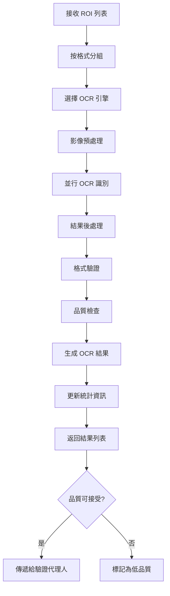

# OCRAgent 設計文件

## 概述

OCRAgent 是 MeterGPT 系統的光學字符識別代理人，負責執行 OCR 識別，支援多種文字識別引擎和格式。它將結構化的 ROI 影像轉換為可讀的文字資料，是系統資料提取的核心組件。

## 核心職責

- **多引擎 OCR 識別**：支援 PaddleOCR、Tesseract 等多種 OCR 引擎
- **專用格式識別**：針對七段顯示器、數位顯示器等特殊格式最佳化
- **批次處理**：高效處理多個 ROI 的並行識別
- **結果後處理**：根據預期格式清理和驗證識別結果
- **品質監控**：監控 OCR 效能和識別品質

## 系統架構

```
┌─────────────────────────────────────────────────────────────────┐
│                      OCRAgent                                   │
├─────────────────────────────────────────────────────────────────┤
│  ┌─────────────────┐  ┌─────────────────┐  ┌─────────────────┐  │
│  │ OCR Processing  │  │ Batch OCR       │  │ OCR Quality     │  │
│  │ Action          │  │ Processing      │  │ Check Action    │  │
│  │                 │  │ Action          │  │                 │  │
│  └─────────────────┘  └─────────────────┘  └─────────────────┘  │
│  ┌─────────────────────────────────────────────────────────────┐  │
│  │                PaddleOCR Manager                           │  │
│  │  ┌─────────────┐ ┌─────────────┐ ┌─────────────────────┐   │  │
│  │  │ General OCR │ │ Seven       │ │ Custom Format       │   │  │
│  │  │ Engine      │ │ Segment OCR │ │ Recognizer          │   │  │
│  │  └─────────────┘ └─────────────┘ └─────────────────────┘   │  │
│  └─────────────────────────────────────────────────────────────┘  │
│  ┌─────────────────────────────────────────────────────────────┐  │
│  │              Text Post-Processing Engine                   │  │
│  │  ┌─────────────┐ ┌─────────────┐ ┌─────────────────────┐   │  │
│  │  │ Number      │ │ Text        │ │ Format Validation   │   │  │
│  │  │ Extraction  │ │ Cleaning    │ │ & Correction        │   │  │
│  │  └─────────────┘ └─────────────┘ └─────────────────────┘   │  │
│  └─────────────────────────────────────────────────────────────┘  │
└─────────────────────────────────────────────────────────────────┘
          │
          ▼ OCRResult
┌─────────────────────────────────────────────────────────────────┐
│              下游代理人 (ValidationAgent)                        │
└─────────────────────────────────────────────────────────────────┘
```

## 核心功能

### 1. OCR 處理 (OCRProcessingAction)

**功能描述**：
- 對單一 ROI 執行 OCR 識別
- 自動選擇最適合的 OCR 引擎
- 執行結果後處理和格式化

**支援的識別格式**：
```python
SUPPORTED_FORMATS = {
    "text": "一般文字識別",
    "number": "數字識別",
    "seven_segment": "七段顯示器識別",
    "lcd": "LCD 顯示器識別",
    "led": "LED 顯示器識別",
    "analog": "類比儀表讀值"
}
```

**輸入**：
- `ROI`：感興趣區域
- `str`：影像幀識別碼

**輸出**：
- `OCRResult`：OCR 識別結果

**識別流程**：
```python
async def recognize_roi(self, roi: ROI, frame_id: str) -> OCRResult:
    # 1. 選擇 OCR 引擎
    ocr_engine = self._select_ocr_engine(roi.expected_format)
    
    # 2. 影像預處理
    preprocessed_image = self._preprocess_roi_image(roi)
    
    # 3. 執行 OCR 識別
    raw_result = await ocr_engine.recognize(preprocessed_image)
    
    # 4. 後處理結果
    processed_result = self._post_process_result(raw_result, roi)
    
    # 5. 建立 OCR 結果
    return self._create_ocr_result(processed_result, roi, frame_id)
```

### 2. 批次 OCR 處理 (BatchOCRProcessingAction)

**功能描述**：
- 並行處理多個 ROI
- 最佳化記憶體和 GPU 使用
- 提供批次處理的效能優勢

**輸入**：
- `List[ROI]`：ROI 列表
- `str`：影像幀識別碼

**輸出**：
- `List[OCRResult]`：OCR 結果列表

**批次處理策略**：
```python
async def batch_process_rois(self, rois: List[ROI], frame_id: str) -> List[OCRResult]:
    # 1. 按格式分組
    format_groups = self._group_rois_by_format(rois)
    
    # 2. 並行處理各組
    tasks = []
    for format_type, roi_group in format_groups.items():
        task = self._process_format_group(format_type, roi_group, frame_id)
        tasks.append(task)
    
    # 3. 等待所有任務完成
    group_results = await asyncio.gather(*tasks, return_exceptions=True)
    
    # 4. 合併結果
    all_results = []
    for results in group_results:
        if isinstance(results, list):
            all_results.extend(results)
    
    return all_results
```

### 3. OCR 品質檢查 (OCRQualityCheckAction)

**功能描述**：
- 評估 OCR 結果的品質和可信度
- 識別常見的 OCR 錯誤模式
- 提供品質改善建議

**品質檢查指標**：
```python
@dataclass
class OCRQualityMetrics:
    confidence_score: float         # 整體信心度
    text_clarity: float            # 文字清晰度
    format_compliance: float       # 格式符合度
    consistency_score: float       # 一致性分數
    error_indicators: List[str]    # 錯誤指標
    quality_grade: str             # 品質等級 (A/B/C/D)
```

## OCR 引擎管理

### 1. PaddleOCR 引擎
```python
class PaddleOCREngine:
    def __init__(self, config):
        self.ocr = PaddleOCR(
            use_angle_cls=True,
            lang=config.language,
            use_gpu=config.use_gpu,
            det_model_dir=config.det_model_dir,
            rec_model_dir=config.rec_model_dir,
            cls_model_dir=config.cls_model_dir
        )
    
    async def recognize(self, image: np.ndarray) -> OCRResult:
        """執行 PaddleOCR 識別"""
        results = self.ocr.ocr(image, cls=True)
        return self._parse_paddle_results(results)
```

### 2. 七段顯示器專用引擎
```python
class SevenSegmentOCR:
    def __init__(self):
        self.digit_templates = self._load_digit_templates()
        self.segment_detector = self._init_segment_detector()
    
    async def recognize(self, image: np.ndarray) -> OCRResult:
        """識別七段顯示器"""
        # 1. 分割數字
        digit_regions = self._segment_digits(image)
        
        # 2. 識別每個數字
        recognized_digits = []
        for region in digit_regions:
            digit = self._recognize_single_digit(region)
            recognized_digits.append(digit)
        
        # 3. 組合結果
        result_text = ''.join(recognized_digits)
        confidence = self._calculate_confidence(digit_regions, recognized_digits)
        
        return OCRResult(
            recognized_text=result_text,
            confidence=confidence,
            ocr_engine="seven_segment"
        )
```

### 3. 自適應引擎選擇
```python
def _select_ocr_engine(self, expected_format: str, image_properties: Dict) -> OCREngine:
    """自適應選擇 OCR 引擎"""
    if expected_format == "seven_segment":
        return self.seven_segment_engine
    
    elif expected_format in ["number", "numeric"]:
        # 根據影像特性選擇數字識別引擎
        if self._is_digital_display(image_properties):
            return self.digital_display_engine
        else:
            return self.general_ocr_engine
    
    elif expected_format == "text":
        return self.general_ocr_engine
    
    else:
        # 預設使用通用引擎
        return self.general_ocr_engine
```

## 工作流程



## 資料格式

### 輸入資料格式

#### ROI
```python
@dataclass
class ROI:
    roi_id: str                 # ROI 唯一識別碼
    field_name: str             # 欄位名稱
    bounding_box: BoundingBox   # ROI 邊界框
    image_data: bytes           # ROI 影像資料
    expected_format: str        # 預期格式
    confidence: float           # ROI 品質信心度
    metadata: Dict[str, Any]    # 額外元資料
```

### 輸出資料格式

#### OCRResult
```python
@dataclass
class OCRResult:
    frame_id: str               # 影像幀識別碼
    roi_id: str                 # ROI 識別碼
    recognized_text: str        # 識別的文字
    confidence: float           # 識別信心度 (0.0-1.0)
    bounding_boxes: List[BoundingBox]  # 文字區域邊界框
    processing_time: float      # 處理時間 (秒)
    ocr_engine: str            # 使用的 OCR 引擎
    timestamp: datetime         # 識別時間戳
    metadata: Dict[str, Any]    # 額外元資料
```

#### BoundingBox
```python
@dataclass
class BoundingBox:
    x: float                    # 左上角 X 座標
    y: float                    # 左上角 Y 座標
    width: float                # 寬度
    height: float               # 高度
    confidence: float           # 邊界框信心度
```

## 與其他代理人的協作關係

### 上游依賴
- **DetectionAgent**：接收結構化的 ROI 資料
- **配置系統**：取得 OCR 引擎配置和參數

### 下游服務
- **ValidationAgent**：提供識別結果進行驗證
- **FallbackAgent**：OCR 失敗時觸發備援機制

### 協作流程
1. **接收階段**：從 DetectionAgent 接收 ROI 列表
2. **識別階段**：執行多引擎 OCR 識別
3. **處理階段**：後處理和格式化結果
4. **傳遞階段**：將結果傳遞給 ValidationAgent

## 配置參數

### OCR 引擎配置
```yaml
ocr:
  # PaddleOCR 配置
  paddle_ocr:
    language: "ch"              # 語言設定
    use_gpu: true               # 使用 GPU 加速
    use_angle_cls: true         # 啟用角度分類
    confidence_threshold: 0.7   # 信心度閾值
    det_model_dir: "./models/paddle_det"
    rec_model_dir: "./models/paddle_rec"
    cls_model_dir: "./models/paddle_cls"
  
  # 七段顯示器 OCR 配置
  seven_segment:
    enabled: true
    confidence_threshold: 0.8
    digit_templates_path: "./templates/seven_segment"
    preprocessing:
      binarization: true
      noise_removal: true
      morphology: true
  
  # 通用配置
  general:
    max_parallel_tasks: 4       # 最大並行任務數
    timeout_seconds: 10         # 識別超時時間
    retry_attempts: 2           # 重試次數
```

### 後處理配置
```yaml
post_processing:
  # 數字提取
  number_extraction:
    decimal_separator: "."      # 小數點分隔符
    thousand_separator: ","     # 千位分隔符
    allow_negative: true        # 允許負數
    max_decimal_places: 3       # 最大小數位數
  
  # 文字清理
  text_cleaning:
    remove_whitespace: true     # 移除多餘空白
    normalize_unicode: true     # Unicode 正規化
    filter_special_chars: true  # 過濾特殊字符
    
  # 格式驗證
  format_validation:
    strict_mode: false          # 嚴格模式
    auto_correction: true       # 自動修正
    confidence_penalty: 0.1     # 修正後的信心度懲罰
```

## 錯誤處理機制

### 1. OCR 引擎初始化失敗
```python
def _handle_engine_init_failure(self, engine_name: str, error: Exception):
    """處理 OCR 引擎初始化失敗"""
    self.logger.error(f"OCR 引擎 {engine_name} 初始化失敗: {error}")
    
    # 嘗試使用備用引擎
    if engine_name == "paddle_ocr":
        self.logger.warning("嘗試使用 Tesseract 作為備用引擎")
        try:
            self._init_tesseract_engine()
        except Exception as backup_error:
            self.logger.error(f"備用引擎也初始化失敗: {backup_error}")
            raise RuntimeError("所有 OCR 引擎都無法初始化")
```

### 2. 識別結果異常處理
```python
def _handle_recognition_failure(self, roi: ROI, error: Exception) -> OCRResult:
    """處理識別失敗"""
    self.logger.error(f"ROI {roi.roi_id} 識別失敗: {error}")
    
    return OCRResult(
        frame_id="unknown",
        roi_id=roi.roi_id,
        recognized_text="",
        confidence=0.0,
        bounding_boxes=[],
        processing_time=0.0,
        ocr_engine="error",
        metadata={"error": str(error)}
    )
```

### 3. 超時處理
```python
async def _recognize_with_timeout(self, roi: ROI, timeout: float) -> OCRResult:
    """帶超時的識別"""
    try:
        return await asyncio.wait_for(
            self._recognize_roi_internal(roi),
            timeout=timeout
        )
    except asyncio.TimeoutError:
        self.logger.warning(f"ROI {roi.roi_id} 識別超時")
        return self._create_timeout_result(roi)
```

## 效能考量

### 1. GPU 記憶體管理
```python
class GPUMemoryManager:
    def __init__(self, max_gpu_memory: float = 0.8):
        self.max_gpu_memory = max_gpu_memory
        self.current_usage = 0.0
    
    async def allocate_for_batch(self, batch_size: int) -> bool:
        """為批次分配 GPU 記憶體"""
        estimated_usage = batch_size * 0.1  # 估算每個 ROI 的記憶體使用
        
        if self.current_usage + estimated_usage > self.max_gpu_memory:
            # 等待記憶體釋放或減少批次大小
            await self._wait_for_memory_or_reduce_batch()
            return False
        
        self.current_usage += estimated_usage
        return True
    
    def release_batch_memory(self, batch_size: int):
        """釋放批次記憶體"""
        estimated_usage = batch_size * 0.1
        self.current_usage = max(0.0, self.current_usage - estimated_usage)
```

### 2. 並行處理最佳化
```python
async def optimized_parallel_processing(self, rois: List[ROI]) -> List[OCRResult]:
    """最佳化的並行處理"""
    # 1. 動態調整並行度
    optimal_concurrency = self._calculate_optimal_concurrency(len(rois))
    
    # 2. 建立信號量控制並行數
    semaphore = asyncio.Semaphore(optimal_concurrency)
    
    # 3. 建立任務
    async def process_with_semaphore(roi):
        async with semaphore:
            return await self._process_single_roi(roi)
    
    tasks = [process_with_semaphore(roi) for roi in rois]
    
    # 4. 執行並收集結果
    results = await asyncio.gather(*tasks, return_exceptions=True)
    
    return [r for r in results if isinstance(r, OCRResult)]
```

### 3. 快取機制
```python
class OCRResultCache:
    def __init__(self, max_size: int = 1000):
        self.cache = {}
        self.max_size = max_size
        self.access_times = {}
    
    def get_cache_key(self, roi: ROI) -> str:
        """生成快取鍵值"""
        image_hash = hashlib.md5(roi.image_data).hexdigest()
        return f"{roi.expected_format}_{image_hash}"
    
    async def get_or_compute(self, roi: ROI, compute_func) -> OCRResult:
        """取得快取結果或計算新結果"""
        cache_key = self.get_cache_key(roi)
        
        if cache_key in self.cache:
            self.access_times[cache_key] = time.time()
            return self.cache[cache_key]
        
        # 計算新結果
        result = await compute_func(roi)
        
        # 加入快取
        self._add_to_cache(cache_key, result)
        
        return result
```

## 監控指標

### 關鍵效能指標 (KPI)
```python
{
    "recognition_rate": 32.5,       # 每秒識別 ROI 數
    "average_confidence": 0.82,     # 平均識別信心度
    "success_rate": 0.94,          # 識別成功率
    "average_processing_time": 85,  # 平均處理時間 (ms)
    "engine_performance": {
        "paddle_ocr": {
            "usage_ratio": 0.75,
            "avg_confidence": 0.85,
            "avg_time": 90
        },
        "seven_segment": {
            "usage_ratio": 0.20,
            "avg_confidence": 0.92,
            "avg_time": 45
        },
        "tesseract": {
            "usage_ratio": 0.05,
            "avg_confidence": 0.68,
            "avg_time": 120
        }
    }
}
```

### 品質統計
```python
{
    "format_distribution": {
        "text": 0.35,
        "number": 0.40,
        "seven_segment": 0.20,
        "other": 0.05
    },
    "confidence_distribution": {
        "high": 0.65,      # > 0.8
        "medium": 0.25,    # 0.6-0.8
        "low": 0.10        # < 0.6
    },
    "common_errors": {
        "character_confusion": 0.08,    # 字符混淆
        "incomplete_recognition": 0.05,  # 識別不完整
        "format_mismatch": 0.03,        # 格式不符
        "timeout": 0.02                 # 超時
    }
}
```

## 使用範例

### 基本使用
```python
from meter_gpt.agents.ocr_agent import OCRAgent

# 初始化 OCR 代理人
ocr_agent = OCRAgent()

# 處理單個 ROI
ocr_result = await ocr_agent.process_single_roi(roi, frame_id)

print(f"識別文字: {ocr_result.recognized_text}")
print(f"信心度: {ocr_result.confidence:.3f}")
print(f"使用引擎: {ocr_result.ocr_engine}")
print(f"處理時間: {ocr_result.processing_time:.3f}s")
```

### 批次處理
```python
# 處理多個 ROI
rois = [roi1, roi2, roi3, roi4]
ocr_results = await ocr_agent.process_rois(rois, frame_id)

# 統計結果
total_results = len(ocr_results)
successful_results = len([r for r in ocr_results if r.recognized_text.strip()])
success_rate = successful_results / total_results

print(f"識別成功率: {success_rate:.2%}")

# 按引擎分組統計
engine_stats = {}
for result in ocr_results:
    engine = result.ocr_engine
    if engine not in engine_stats:
        engine_stats[engine] = {"count": 0, "total_confidence": 0.0}
    
    engine_stats[engine]["count"] += 1
    engine_stats[engine]["total_confidence"] += result.confidence

for engine, stats in engine_stats.items():
    avg_confidence = stats["total_confidence"] / stats["count"]
    print(f"{engine}: {stats['count']} 次, 平均信心度: {avg_confidence:.3f}")
```

### 品質監控
```python
# 取得 OCR 統計
stats = ocr_agent.get_ocr_statistics("cam_001")
print(f"總處理數: {stats['total_processed']}")
print(f"成功識別數: {stats['successful_recognitions']}")
print(f"平均信心度: {stats['average_confidence']:.3f}")
print(f"平均處理時間: {stats['average_processing_time']:.3f}s")

# 取得效能摘要
summary = await ocr_agent.get_performance_summary()
print(f"整體效能等級: {summary['performance_grade']}")
print(f"建議改善項目: {summary['recommendations']}")
```

### 自定義配置
```python
# 使用自定義配置
custom_config = {
    "paddle_ocr": {
        "confidence_threshold": 0.8,
        "use_gpu": True
    },
    "seven_segment": {
        "enabled": True,
        "confidence_threshold": 0.9
    },
    "post_processing": {
        "number_extraction": {
            "decimal_separator": ".",
            "allow_negative": True
        }
    }
}

ocr_agent = OCRAgent(config=custom_config)
```

## 故障排除

### 常見問題

1. **識別準確率低**
   - 檢查 ROI 影像品質
   - 調整 OCR 引擎參數
   - 嘗試不同的預處理方法

2. **處理速度慢**
   - 啟用 GPU 加速
   - 調整並行處理數量
   - 使用快取機制

3. **特定格式識別失敗**
   - 檢查格式配置
   - 更新專用引擎
   - 調整後處理規則

### 除錯工具
```python
# 啟用詳細日誌
ocr_agent.set_log_level("DEBUG")

# 匯出識別結果
ocr_agent.export_recognition_results("cam_001", format="json")

# 視覺化識別過程
ocr_agent.visualize_recognition_process(roi, save_path="debug/")

# 效能分析
performance_report = ocr_agent.generate_performance_report()
```

## 未來擴展

### 計劃功能
- **多語言支援**：擴展對更多語言的識別支援
- **手寫文字識別**：支援手寫數字和文字的識別
- **版面分析**：智慧分析複雜版面的文字結構
- **增量學習**：根據使用者回饋持續改善識別準確率

### 技術改進
- **Transformer OCR**：使用 Vision Transformer 提升識別精度
- **端到端最佳化**：整合檢測和識別的端到端模型
- **自適應預處理**：根據影像特性自動選擇最佳預處理方法
- **邊緣計算最佳化**：針對邊緣設備的輕量化模型