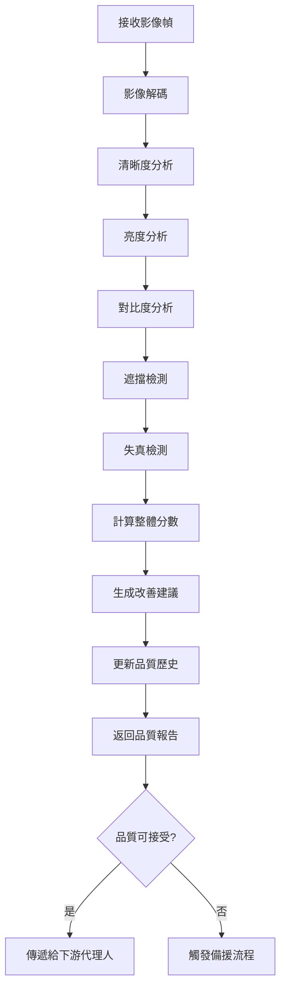

# QualityAssessor 設計文件

## 概述

QualityAssessor 是 MeterGPT 系統的品質評估代理人，負責評估影像品質並計算「健康分數」，為後續處理提供品質依據。它是系統品質控制的關鍵組件，確保只有符合標準的影像才會進入後續的處理流程。

## 核心職責

- **影像品質評估**：分析影像的清晰度、亮度、對比度等關鍵指標
- **健康分數計算**：綜合各項指標計算整體品質分數
- **品質趨勢分析**：追蹤攝影機品質變化趨勢
- **改善建議生成**：根據品質問題提供具體的改善建議
- **攝影機比較**：比較多個攝影機的品質表現

## 系統架構

```
┌─────────────────────────────────────────────────────────────────┐
│                    QualityAssessor                             │
├─────────────────────────────────────────────────────────────────┤
│  ┌─────────────────┐  ┌─────────────────┐  ┌─────────────────┐  │
│  │ Quality         │  │ Batch Quality   │  │ Trend Analysis  │  │
│  │ Assessment      │  │ Assessment      │  │ Engine          │  │
│  │ Action          │  │ Action          │  │                 │  │
│  └─────────────────┘  └─────────────────┘  └─────────────────┘  │
│  ┌─────────────────────────────────────────────────────────────┐  │
│  │              OpenCV Quality Assessor                       │  │
│  │  ┌─────────────┐ ┌─────────────┐ ┌─────────────────────┐   │  │
│  │  │ Sharpness   │ │ Brightness  │ │ Contrast & Noise    │   │  │
│  │  │ Detection   │ │ Analysis    │ │ Analysis            │   │  │
│  │  └─────────────┘ └─────────────┘ └─────────────────────┘   │  │
│  └─────────────────────────────────────────────────────────────┘  │
└─────────────────────────────────────────────────────────────────┘
          │
          ▼ QualityReport
┌─────────────────────────────────────────────────────────────────┐
│              下游代理人 (DetectionAgent, FallbackAgent)          │
└─────────────────────────────────────────────────────────────────┘
```

## 核心功能

### 1. 品質評估 (QualityAssessmentAction)

**功能描述**：
- 對單一影像幀進行全面品質分析
- 計算多維度品質指標
- 生成詳細的品質報告

**輸入**：
- `StreamFrame`：待評估的影像幀

**輸出**：
- `QualityReport`：包含詳細品質指標的報告

**評估指標**：
```python
@dataclass
class QualityMetrics:
    sharpness_score: float      # 清晰度分數 (0.0-1.0)
    brightness_score: float     # 亮度分數 (0.0-1.0)
    contrast_score: float       # 對比度分數 (0.0-1.0)
    occlusion_ratio: float      # 遮擋比例 (0.0-1.0)
    distortion_score: float     # 失真分數 (0.0-1.0)
    overall_score: float        # 整體品質分數 (0.0-1.0)
```

### 2. 批次品質評估 (BatchQualityAssessmentAction)

**功能描述**：
- 並行處理多個影像幀
- 提供批次處理的效能最佳化
- 支援大量影像的快速評估

**輸入**：
- `List[StreamFrame]`：影像幀列表

**輸出**：
- `List[QualityReport]`：品質報告列表

### 3. 品質趨勢分析

**功能描述**：
- 分析攝影機品質的時間序列變化
- 預測品質趨勢
- 識別品質異常

**關鍵演算法**：
```python
def calculate_quality_trend(self, camera_id: str, window_size: int = 10):
    """計算品質趨勢"""
    history = self.quality_history[camera_id][-window_size:]
    scores = [report.metrics.overall_score for report in history]
    
    # 線性回歸計算趨勢
    trend = self._linear_regression_slope(scores)
    
    # 穩定性分析
    stability = 1.0 / (1.0 + np.std(scores))
    
    return {
        'trend': trend,           # 正值表示品質改善，負值表示品質下降
        'stability': stability,   # 0.0-1.0，越高越穩定
        'current_score': scores[-1] if scores else 0.0
    }
```

## 工作流程



## 品質評估演算法

### 1. 清晰度評估
```python
def assess_sharpness(self, image: np.ndarray) -> float:
    """評估影像清晰度"""
    # 使用 Laplacian 變異數方法
    gray = cv2.cvtColor(image, cv2.COLOR_BGR2GRAY)
    laplacian_var = cv2.Laplacian(gray, cv2.CV_64F).var()
    
    # 正規化到 0-1 範圍
    normalized_score = min(laplacian_var / 1000.0, 1.0)
    return normalized_score
```

### 2. 亮度評估
```python
def assess_brightness(self, image: np.ndarray) -> float:
    """評估影像亮度"""
    # 轉換為 HSV 色彩空間
    hsv = cv2.cvtColor(image, cv2.COLOR_BGR2HSV)
    brightness = np.mean(hsv[:, :, 2]) / 255.0
    
    # 計算與理想亮度的偏差
    ideal_brightness = 0.5
    deviation = abs(brightness - ideal_brightness)
    score = max(0.0, 1.0 - deviation * 2)
    
    return score
```

### 3. 對比度評估
```python
def assess_contrast(self, image: np.ndarray) -> float:
    """評估影像對比度"""
    gray = cv2.cvtColor(image, cv2.COLOR_BGR2GRAY)
    
    # 計算標準差作為對比度指標
    contrast = np.std(gray) / 255.0
    
    # 正規化分數
    normalized_score = min(contrast * 4, 1.0)
    return normalized_score
```

### 4. 遮擋檢測
```python
def detect_occlusion(self, image: np.ndarray) -> float:
    """檢測影像遮擋"""
    gray = cv2.cvtColor(image, cv2.COLOR_BGR2GRAY)
    
    # 使用邊緣檢測
    edges = cv2.Canny(gray, 50, 150)
    edge_ratio = np.sum(edges > 0) / edges.size
    
    # 低邊緣比例可能表示遮擋
    if edge_ratio < 0.01:  # 閾值可調整
        return 1.0  # 高遮擋比例
    else:
        return max(0.0, 1.0 - edge_ratio * 100)
```

## 資料格式

### 輸入資料格式

#### StreamFrame
```python
@dataclass
class StreamFrame:
    frame_id: str
    camera_info: CameraInfo
    frame_data: bytes           # JPEG 編碼的影像資料
    frame_shape: Tuple[int, int, int]
    timestamp: datetime
    metadata: Dict[str, Any]
```

### 輸出資料格式

#### QualityReport
```python
@dataclass
class QualityReport:
    frame_id: str               # 影像幀識別碼
    camera_id: str              # 攝影機識別碼
    metrics: QualityMetrics     # 詳細品質指標
    is_acceptable: bool         # 是否達到可接受品質
    recommendations: List[str]  # 改善建議
    timestamp: datetime         # 評估時間戳
    processing_time: float      # 處理時間 (秒)
```

#### QualityMetrics
```python
@dataclass
class QualityMetrics:
    sharpness_score: float      # 清晰度分數 (0.0-1.0)
    brightness_score: float     # 亮度分數 (0.0-1.0)
    contrast_score: float       # 對比度分數 (0.0-1.0)
    occlusion_ratio: float      # 遮擋比例 (0.0-1.0)
    distortion_score: float     # 失真分數 (0.0-1.0)
    overall_score: float        # 整體品質分數 (0.0-1.0)
```

## 與其他代理人的協作關係

### 上游依賴
- **StreamManager**：接收影像幀進行品質評估
- **配置系統**：取得品質閾值和評估參數

### 下游服務
- **DetectionAgent**：只有通過品質檢查的影像才會進行偵測
- **FallbackAgent**：品質不佳時觸發備援機制
- **Orchestrator**：提供品質決策依據

### 協作流程
1. **接收階段**：從 StreamManager 接收影像幀
2. **評估階段**：執行全面的品質分析
3. **決策階段**：判斷是否達到處理標準
4. **回饋階段**：向 FallbackAgent 提供品質資訊

## 配置參數

### 基本配置
```yaml
quality_assessment:
  overall_threshold: 0.6        # 整體品質閾值
  sharpness_threshold: 0.3      # 清晰度閾值
  brightness_range: [0.2, 0.8]  # 可接受亮度範圍
  contrast_threshold: 0.3       # 對比度閾值
  occlusion_threshold: 0.3      # 遮擋比例閾值
  
  # 權重設定
  weights:
    sharpness: 0.3
    brightness: 0.2
    contrast: 0.2
    occlusion: 0.2
    distortion: 0.1
```

### 進階配置
```yaml
quality_assessment:
  adaptive_thresholds: true     # 啟用自適應閾值
  trend_analysis:
    enabled: true
    window_size: 10
    alert_threshold: -0.1       # 品質下降警告閾值
  
  performance:
    batch_size: 5               # 批次處理大小
    parallel_processing: true   # 啟用並行處理
    cache_size: 100            # 歷史記錄快取大小
```

## 錯誤處理機制

### 1. 影像解碼失敗
```python
async def handle_decode_failure(self, stream_frame: StreamFrame) -> QualityReport:
    """處理影像解碼失敗"""
    self.logger.error(f"影像解碼失敗: {stream_frame.frame_id}")
    
    return QualityReport(
        frame_id=stream_frame.frame_id,
        camera_id=stream_frame.camera_info.camera_id,
        metrics=QualityMetrics(
            sharpness_score=0.0,
            brightness_score=0.0,
            contrast_score=0.0,
            occlusion_ratio=1.0,
            distortion_score=0.0,
            overall_score=0.0
        ),
        is_acceptable=False,
        recommendations=["影像解碼失敗，請檢查影像格式和完整性"]
    )
```

### 2. 評估演算法異常
- **容錯機制**：單一指標失敗不影響其他指標計算
- **預設值**：異常時使用保守的預設分數
- **日誌記錄**：詳細記錄異常資訊供除錯

### 3. 效能問題處理
- **超時保護**：設定評估超時時間
- **資源監控**：監控 CPU 和記憶體使用
- **降級策略**：高負載時簡化評估演算法

## 效能考量

### 1. 計算最佳化
```python
# 使用 NumPy 向量化操作
def vectorized_quality_assessment(self, images: List[np.ndarray]) -> List[float]:
    """向量化品質評估"""
    # 批次處理多個影像
    batch_scores = []
    for batch in self._create_batches(images, batch_size=8):
        scores = self._parallel_assess_batch(batch)
        batch_scores.extend(scores)
    return batch_scores
```

### 2. 記憶體管理
- **串流處理**：避免載入過多影像到記憶體
- **快取策略**：智慧快取常用的評估結果
- **垃圾回收**：及時釋放處理完的影像資料

### 3. 並行處理
```python
async def parallel_assessment(self, stream_frames: List[StreamFrame]) -> List[QualityReport]:
    """並行品質評估"""
    tasks = [
        self.assess_single_frame(frame)
        for frame in stream_frames
    ]
    
    results = await asyncio.gather(*tasks, return_exceptions=True)
    return [r for r in results if isinstance(r, QualityReport)]
```

## 監控指標

### 關鍵效能指標 (KPI)
```python
{
    "assessment_rate": 28.5,        # 每秒評估幀數
    "average_score": 0.75,          # 平均品質分數
    "acceptable_ratio": 0.85,       # 可接受品質比例
    "processing_time_ms": 35.2,     # 平均處理時間
    "trend_stability": 0.92,        # 品質趨勢穩定性
    "error_rate": 0.001            # 錯誤率
}
```

### 品質分佈統計
```python
{
    "score_distribution": {
        "excellent": 0.25,      # 0.8-1.0
        "good": 0.45,          # 0.6-0.8
        "fair": 0.25,          # 0.4-0.6
        "poor": 0.05           # 0.0-0.4
    },
    "common_issues": {
        "low_sharpness": 0.15,
        "poor_lighting": 0.08,
        "occlusion": 0.03
    }
}
```

## 使用範例

### 基本使用
```python
from meter_gpt.agents.quality_assessor import QualityAssessor

# 初始化品質評估器
quality_assessor = QualityAssessor()

# 評估單一影像幀
quality_report = await quality_assessor.assess_single_frame(stream_frame)

print(f"整體品質分數: {quality_report.metrics.overall_score:.3f}")
print(f"是否可接受: {quality_report.is_acceptable}")

# 取得改善建議
for recommendation in quality_report.recommendations:
    print(f"建議: {recommendation}")
```

### 批次評估
```python
# 批次評估多個影像幀
stream_frames = [frame1, frame2, frame3]
quality_reports = await quality_assessor.assess_multiple_frames(stream_frames)

# 統計結果
acceptable_count = sum(1 for report in quality_reports if report.is_acceptable)
print(f"可接受品質比例: {acceptable_count / len(quality_reports):.2%}")
```

### 品質趨勢分析
```python
# 取得攝影機品質趨勢
trend_data = quality_assessor.get_camera_quality_trend("cam_001")

print(f"品質趨勢: {trend_data['trend']:.3f}")
print(f"穩定性: {trend_data['stability']:.3f}")
print(f"當前分數: {trend_data['current_score']:.3f}")

# 比較多個攝影機
camera_ids = ["cam_001", "cam_002", "cam_003"]
best_camera = quality_assessor.get_best_quality_camera(camera_ids)
print(f"品質最佳攝影機: {best_camera}")
```

### 品質監控
```python
# 取得品質摘要
summary = await quality_assessor.get_quality_summary()

print(f"總攝影機數: {summary['total_cameras']}")
print(f"整體健康度: {summary['overall_health']:.3f}")

for camera_id, quality_info in summary['camera_quality'].items():
    print(f"攝影機 {camera_id}:")
    print(f"  當前分數: {quality_info['current_score']:.3f}")
    print(f"  是否可接受: {quality_info['is_acceptable']}")
    print(f"  趨勢: {quality_info['trend']:.3f}")
```

## 故障排除

### 常見問題

1. **品質分數異常低**
   - 檢查攝影機鏡頭是否清潔
   - 確認照明條件是否充足
   - 驗證攝影機焦距設定

2. **評估速度過慢**
   - 啟用並行處理
   - 調整批次大小
   - 檢查 CPU 使用率

3. **品質趨勢不穩定**
   - 增加歷史視窗大小
   - 檢查攝影機安裝穩定性
   - 分析環境因素影響

### 除錯工具
```python
# 啟用詳細品質分析
quality_assessor.enable_detailed_analysis()

# 匯出品質報告
report = quality_assessor.export_quality_report("cam_001", days=7)

# 視覺化品質趨勢
quality_assessor.plot_quality_trend("cam_001")
```

## 未來擴展

### 計劃功能
- **深度學習品質評估**：使用 CNN 模型進行更精確的品質評估
- **自適應閾值**：根據環境條件自動調整品質閾值
- **預測性維護**：預測攝影機品質下降趨勢
- **多模態評估**：結合音訊等其他感測器資料

### 演算法改進
- **感知品質評估**：基於人眼視覺特性的品質評估
- **場景適應性**：針對不同場景類型的專用評估演算法
- **即時最佳化**：根據下游處理結果回饋調整評估策略