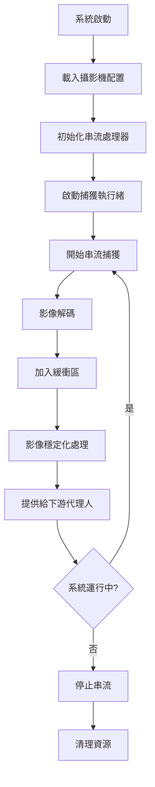

# StreamManager 設計文件

## 概述

StreamManager 是 MeterGPT 系統的串流管理代理人，負責管理多個攝影機的影像串流，作為系統的資料中心匯流排。它提供統一的串流捕獲、緩衝管理和影像預處理功能。

## 核心職責

- **多攝影機串流管理**：同時管理多個攝影機的 RTSP 串流
- **影像緩衝控制**：維護每個攝影機的影像緩衝區，確保資料流暢
- **串流品質監控**：監控串流狀態和連接品質
- **主備攝影機切換**：支援主要和備援攝影機之間的動態切換
- **影像預處理**：提供基本的影像增強和穩定化功能

## 系統架構

```
┌─────────────────┐    ┌─────────────────┐    ┌─────────────────┐
│   Camera 1      │    │   Camera 2      │    │   Camera N      │
│   (Primary)     │    │   (Backup)      │    │   (Backup)      │
└─────────┬───────┘    └─────────┬───────┘    └─────────┬───────┘
          │                      │                      │
          │ RTSP Stream          │ RTSP Stream          │ RTSP Stream
          │                      │                      │
          ▼                      ▼                      ▼
┌─────────────────────────────────────────────────────────────────┐
│                    StreamManager                                │
├─────────────────────────────────────────────────────────────────┤
│  ┌─────────────┐  ┌─────────────┐  ┌─────────────────────────┐  │
│  │ Capture     │  │ Buffer      │  │ Stream Processor        │  │
│  │ Threads     │  │ Management  │  │ (Stabilization)         │  │
│  └─────────────┘  └─────────────┘  └─────────────────────────┘  │
└─────────────────────────────────────────────────────────────────┘
          │
          ▼ StreamFrame
┌─────────────────────────────────────────────────────────────────┐
│              下游代理人 (QualityAssessor, etc.)                  │
└─────────────────────────────────────────────────────────────────┘
```

## 核心功能

### 1. 串流捕獲 (StreamCaptureAction)

**功能描述**：
- 從 RTSP 串流捕獲影像幀
- 支援多種影像格式和解析度
- 自動重連機制

**輸入**：
- `CameraInfo`：攝影機配置資訊

**輸出**：
- `StreamFrame`：包含影像資料和元資料的串流幀

**關鍵參數**：
```python
{
    "frame_rate": 30,           # 目標幀率 (FPS)
    "buffer_size": 10,          # 緩衝區大小
    "reconnect_timeout": 5.0,   # 重連超時時間
    "encoding_format": "jpg"    # 影像編碼格式
}
```

### 2. 串流管理 (StreamManagementAction)

**功能描述**：
- 協調多個攝影機的串流
- 管理緩衝區狀態
- 提供最新影像幀

**輸入**：
- `List[CameraInfo]`：攝影機列表
- `Dict[str, Queue]`：串流緩衝區

**輸出**：
- `Dict[str, StreamFrame]`：各攝影機的最新幀

### 3. 影像穩定化

**功能描述**：
- 使用 OpenCV 進行影像穩定化
- 減少攝影機震動影響
- 提供穩定的影像幀供後續處理

## 工作流程



## 資料格式

### 輸入資料格式

#### CameraInfo
```python
@dataclass
class CameraInfo:
    camera_id: str              # 攝影機唯一識別碼
    camera_name: str            # 攝影機名稱
    position: Tuple[float, float, float]  # 攝影機位置 (x, y, z)
    is_active: bool             # 是否啟用
    is_primary: bool            # 是否為主要攝影機
    rtsp_url: Optional[str]     # RTSP 串流地址
```

### 輸出資料格式

#### StreamFrame
```python
@dataclass
class StreamFrame:
    frame_id: str               # 影像幀唯一識別碼
    camera_info: CameraInfo     # 攝影機資訊
    frame_data: bytes           # 編碼後的影像資料
    frame_shape: Tuple[int, int, int]  # 影像尺寸 (H, W, C)
    timestamp: datetime         # 捕獲時間戳
    metadata: Dict[str, Any]    # 額外元資料
```

## 與其他代理人的協作關係

### 上游依賴
- **配置系統**：取得攝影機配置和系統參數
- **硬體層**：連接實際的攝影機設備

### 下游服務
- **QualityAssessor**：提供影像幀進行品質評估
- **DetectionAgent**：提供影像幀進行儀器偵測
- **FallbackAgent**：在需要時提供備援攝影機切換

### 協作流程
1. **啟動階段**：從配置系統載入攝影機設定
2. **運行階段**：持續提供穩定的影像串流
3. **異常處理**：與 FallbackAgent 協作進行攝影機切換

## 配置參數

### 基本配置
```yaml
stream_manager:
  max_cameras: 8              # 最大支援攝影機數量
  default_fps: 30             # 預設幀率
  buffer_size: 10             # 預設緩衝區大小
  reconnect_attempts: 3       # 重連嘗試次數
  
cameras:
  - camera_id: "cam_001"
    camera_name: "主要攝影機"
    rtsp_url: "rtsp://192.168.1.100:554/stream"
    position: [0.0, 0.0, 1.5]
    is_active: true
    is_primary: true
    
  - camera_id: "cam_002"
    camera_name: "備援攝影機"
    rtsp_url: "rtsp://192.168.1.101:554/stream"
    position: [1.0, 0.0, 1.5]
    is_active: true
    is_primary: false
```

### 進階配置
```yaml
stream_processing:
  stabilization:
    enabled: true
    smoothing_radius: 50
    crop_ratio: 0.9
    
  enhancement:
    auto_contrast: true
    noise_reduction: true
    sharpening: false
```

## 錯誤處理機制

### 1. 連接失敗處理
```python
async def handle_connection_failure(self, camera_id: str):
    """處理攝影機連接失敗"""
    retry_count = 0
    max_retries = self.config.reconnect_attempts
    
    while retry_count < max_retries:
        try:
            await self.reconnect_camera(camera_id)
            break
        except Exception as e:
            retry_count += 1
            await asyncio.sleep(2 ** retry_count)  # 指數退避
    
    if retry_count >= max_retries:
        await self.mark_camera_inactive(camera_id)
        await self.notify_fallback_agent(camera_id)
```

### 2. 緩衝區溢出處理
- **策略**：FIFO (先進先出) 丟棄舊幀
- **監控**：記錄丟幀統計
- **告警**：當丟幀率超過閾值時發出警告

### 3. 影像品質異常處理
- **檢測**：監控影像的基本品質指標
- **回應**：自動調整攝影機參數或切換攝影機
- **記錄**：記錄品質異常事件供後續分析

## 效能考量

### 1. 記憶體管理
- **緩衝區大小**：根據系統記憶體動態調整
- **影像壓縮**：使用適當的壓縮比例平衡品質和效能
- **垃圾回收**：定期清理過期的影像幀

### 2. CPU 使用率
- **多執行緒**：每個攝影機使用獨立的捕獲執行緒
- **非同步處理**：使用 asyncio 提高並發效能
- **負載平衡**：根據 CPU 使用率動態調整處理優先級

### 3. 網路頻寬
- **適應性串流**：根據網路狀況調整影像品質
- **壓縮最佳化**：選擇最適合的編碼格式
- **頻寬監控**：監控網路使用率並進行調整

## 監控指標

### 關鍵效能指標 (KPI)
```python
{
    "fps_actual": 29.8,         # 實際幀率
    "fps_target": 30.0,         # 目標幀率
    "buffer_usage": 0.7,        # 緩衝區使用率
    "drop_rate": 0.02,          # 丟幀率
    "latency_ms": 33.5,         # 延遲時間
    "connection_uptime": 0.995  # 連接正常運行時間比例
}
```

### 健康狀態監控
- **連接狀態**：各攝影機的連接狀況
- **串流品質**：影像品質和穩定性
- **系統資源**：CPU、記憶體、網路使用率
- **錯誤統計**：各類錯誤的發生頻率

## 使用範例

### 基本使用
```python
from meter_gpt.agents.stream_manager import StreamManager

# 初始化串流管理器
stream_manager = StreamManager()

# 啟動串流捕獲
await stream_manager.start_streaming()

# 取得最新影像幀
frame = stream_manager.get_latest_frame("cam_001")

# 取得穩定化影像
stable_frame = stream_manager.get_stable_frame("cam_001")

# 切換主要攝影機
success = stream_manager.switch_primary_camera("cam_002")

# 取得串流狀態
status = await stream_manager.get_stream_status()
```

### 進階使用
```python
# 自定義配置
config = {
    "buffer_size": 15,
    "fps": 25,
    "stabilization": True
}

stream_manager = StreamManager(config=config)

# 監控串流品質
async def monitor_stream_quality():
    while True:
        status = await stream_manager.get_stream_status()
        for camera_id, camera_status in status["camera_status"].items():
            if camera_status["drop_rate"] > 0.05:  # 丟幀率超過 5%
                logger.warning(f"Camera {camera_id} high drop rate")
        
        await asyncio.sleep(10)

# 啟動監控
asyncio.create_task(monitor_stream_quality())
```

## 故障排除

### 常見問題

1. **攝影機連接失敗**
   - 檢查網路連接
   - 驗證 RTSP URL 正確性
   - 確認攝影機電源和設定

2. **影像延遲過高**
   - 調整緩衝區大小
   - 檢查網路頻寬
   - 降低影像解析度或幀率

3. **記憶體使用過高**
   - 減少緩衝區大小
   - 增加影像壓縮比例
   - 檢查是否有記憶體洩漏

### 除錯工具
```python
# 啟用詳細日誌
stream_manager.set_log_level("DEBUG")

# 取得詳細狀態
detailed_status = await stream_manager.get_detailed_status()

# 匯出效能報告
performance_report = stream_manager.export_performance_report()
```

## 未來擴展

### 計劃功能
- **AI 驅動的品質最佳化**：使用機器學習自動調整攝影機參數
- **邊緣運算支援**：支援邊緣設備上的串流處理
- **多協定支援**：支援 WebRTC、HLS 等其他串流協定
- **雲端整合**：支援雲端攝影機和混合部署

### 效能最佳化
- **硬體加速**：利用 GPU 進行影像處理
- **智慧快取**：基於使用模式的智慧快取策略
- **預測性維護**：預測攝影機故障並提前處理