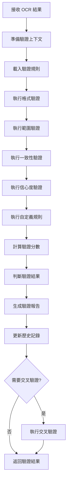

# ValidationAgent 設計文件

## 概述

ValidationAgent 是 MeterGPT 系統的驗證代理人，負責驗證 OCR 結果的合理性和準確性，確保讀值品質。它是系統品質保證的最後一道防線，通過多重驗證規則確保輸出結果的可靠性。

## 核心職責

- **結果驗證**：對 OCR 識別結果進行多維度驗證
- **規則引擎**：管理和執行各種驗證規則
- **交叉驗證**：比較多個來源的識別結果
- **異常檢測**：識別不合理或異常的讀值
- **品質評分**：為驗證結果提供量化的品質分數

## 系統架構

```
┌─────────────────────────────────────────────────────────────────┐
│                   ValidationAgent                              │
├─────────────────────────────────────────────────────────────────┤
│  ┌─────────────────┐  ┌─────────────────┐  ┌─────────────────┐  │
│  │ Validation      │  │ Cross           │  │ Rule Engine     │  │
│  │ Action          │  │ Validation      │  │ Manager         │  │
│  │                 │  │ Action          │  │                 │  │
│  └─────────────────┘  └─────────────────┘  └─────────────────┘  │
│  ┌─────────────────────────────────────────────────────────────┐  │
│  │              Validation Rule Engine                        │  │
│  │  ┌─────────────┐ ┌─────────────┐ ┌─────────────────────┐   │  │
│  │  │ Format      │ │ Range       │ │ Consistency         │   │  │
│  │  │ Rules       │ │ Rules       │ │ Rules               │   │  │
│  │  └─────────────┘ └─────────────┘ └─────────────────────┘   │  │
│  │  ┌─────────────┐ ┌─────────────┐ ┌─────────────────────┐   │  │
│  │  │ Confidence  │ │ Length      │ │ Custom Rules        │   │  │
│  │  │ Rules       │ │ Rules       │ │                     │   │  │
│  │  └─────────────┘ └─────────────┘ └─────────────────────┘   │  │
│  └─────────────────────────────────────────────────────────────┘  │
│  ┌─────────────────────────────────────────────────────────────┐  │
│  │              Statistical Analysis Engine                   │  │
│  │  ┌─────────────┐ ┌─────────────┐ ┌─────────────────────┐   │  │
│  │  │ Trend       │ │ Outlier     │ │ Pattern             │   │  │
│  │  │ Analysis    │ │ Detection   │ │ Recognition         │   │  │
│  │  └─────────────┘ └─────────────┘ └─────────────────────┘   │  │
│  └─────────────────────────────────────────────────────────────┘  │
└─────────────────────────────────────────────────────────────────┘
          │
          ▼ ValidationResult
┌─────────────────────────────────────────────────────────────────┐
│              下游代理人 (Orchestrator, FallbackAgent)            │
└─────────────────────────────────────────────────────────────────┘
```

## 核心功能

### 1. 驗證規則引擎 (ValidationRuleEngine)

**功能描述**：
- 管理和執行各種驗證規則
- 支援內建和自定義規則
- 提供規則組合和優先級管理

**內建驗證規則**：
```python
BUILT_IN_RULES = {
    "numeric_format": {
        "description": "數值格式驗證",
        "pattern": r"^-?\d+\.?\d*$",
        "allow_empty": False
    },
    "range_check": {
        "description": "數值範圍檢查",
        "min_value": -999999,
        "max_value": 999999
    },
    "length_check": {
        "description": "文字長度檢查",
        "min_length": 1,
        "max_length": 50
    },
    "consistency_check": {
        "description": "一致性檢查",
        "tolerance": 0.1,
        "history_window": 5
    },
    "confidence_threshold": {
        "description": "信心度閾值檢查",
        "min_confidence": 0.7
    }
}
```

**規則執行流程**：
```python
def apply_rule(self, rule: ValidationRule, ocr_result: OCRResult, 
               context: Dict[str, Any] = None) -> Dict[str, Any]:
    """應用驗證規則"""
    try:
        if rule.rule_type == "format":
            return self._apply_format_rule(rule, ocr_result)
        elif rule.rule_type == "range":
            return self._apply_range_rule(rule, ocr_result)
        elif rule.rule_type == "consistency":
            return self._apply_consistency_rule(rule, ocr_result, context)
        # ... 其他規則類型
        
    except Exception as e:
        return {
            "passed": False,
            "message": f"規則執行異常: {str(e)}"
        }
```

### 2. 驗證動作 (ValidationAction)

**功能描述**：
- 對 OCR 結果執行完整的驗證流程
- 計算驗證分數和可信度
- 生成詳細的驗證報告

**輸入**：
- `List[OCRResult]`：OCR 結果列表
- `Dict[str, Any]`：驗證上下文

**輸出**：
- `List[ValidationResult]`：驗證結果列表

**驗證流程**：
```python
async def validate_ocr_results(self, ocr_results: List[OCRResult], 
                              context: Dict[str, Any] = None) -> List[ValidationResult]:
    validation_results = []
    
    for ocr_result in ocr_results:
        # 1. 準備驗證上下文
        validation_context = self._prepare_validation_context(ocr_result, context)
        
        # 2. 執行所有驗證規則
        rule_results = []
        for rule in self.validation_rules:
            rule_result = self.rule_engine.apply_rule(rule, ocr_result, validation_context)
            rule_results.append(rule_result)
        
        # 3. 計算驗證分數
        validation_score = self._calculate_validation_score(rule_results)
        
        # 4. 判斷是否通過驗證
        is_valid = self._determine_validity(rule_results, validation_score)
        
        # 5. 生成驗證結果
        validation_result = ValidationResult(
            frame_id=ocr_result.frame_id,
            is_valid=is_valid,
            validation_score=validation_score,
            applied_rules=[rule.rule_id for rule in self.validation_rules],
            error_messages=self._extract_error_messages(rule_results),
            warnings=self._extract_warnings(rule_results)
        )
        
        validation_results.append(validation_result)
    
    return validation_results
```

### 3. 交叉驗證 (CrossValidationAction)

**功能描述**：
- 比較多個來源的識別結果
- 檢測結果間的一致性
- 提供交叉驗證的信心度評估

**交叉驗證策略**：
```python
async def cross_validate_results(self, ocr_results: List[OCRResult]) -> Dict[str, Any]:
    """執行交叉驗證"""
    if len(ocr_results) < 2:
        return {
            "cross_validation_possible": False,
            "message": "需要至少兩個 OCR 結果進行交叉驗證"
        }
    
    # 1. 按 ROI 分組
    roi_groups = self._group_by_roi(ocr_results)
    
    # 2. 對每組執行交叉驗證
    cross_validation_results = {}
    for roi_id, results in roi_groups.items():
        if len(results) >= 2:
            cross_validation_results[roi_id] = self._cross_validate_roi_results(results)
    
    # 3. 生成總結報告
    summary = self._summarize_cross_validation(cross_validation_results)
    
    return {
        "cross_validation_possible": True,
        "results": cross_validation_results,
        "summary": summary
    }
```

## 驗證規則詳解

### 1. 格式驗證規則
```python
def _apply_format_rule(self, rule: ValidationRule, ocr_result: OCRResult) -> Dict[str, Any]:
    """應用格式驗證規則"""
    text = ocr_result.recognized_text.strip()
    pattern = rule.parameters.get("pattern", ".*")
    allow_empty = rule.parameters.get("allow_empty", True)
    
    # 檢查空值
    if not text and not allow_empty:
        return {
            "passed": False,
            "message": "識別結果為空"
        }
    
    # 檢查格式
    if text and not re.match(pattern, text):
        return {
            "passed": False,
            "message": f"格式不符合要求: {text}"
        }
    
    return {
        "passed": True,
        "message": "格式驗證通過"
    }
```

### 2. 範圍驗證規則
```python
def _apply_range_rule(self, rule: ValidationRule, ocr_result: OCRResult) -> Dict[str, Any]:
    """應用範圍驗證規則"""
    text = ocr_result.recognized_text.strip()
    
    try:
        value = float(text)
        min_value = rule.parameters.get("min_value", float('-inf'))
        max_value = rule.parameters.get("max_value", float('inf'))
        
        if value < min_value or value > max_value:
            return {
                "passed": False,
                "message": f"數值超出範圍 [{min_value}, {max_value}]: {value}"
            }
        
        return {
            "passed": True,
            "message": "範圍驗證通過"
        }
        
    except ValueError:
        return {
            "passed": False,
            "message": f"無法轉換為數值: {text}"
        }
```

### 3. 一致性驗證規則
```python
def _apply_consistency_rule(self, rule: ValidationRule, ocr_result: OCRResult, 
                           context: Dict[str, Any]) -> Dict[str, Any]:
    """應用一致性驗證規則"""
    if not context or 'history' not in context:
        return {
            "passed": True,
            "message": "無歷史資料，跳過一致性檢查"
        }
    
    try:
        current_text = ocr_result.recognized_text.strip()
        current_value = float(current_text)
        
        history = context['history']
        window_size = rule.parameters.get("history_window", 5)
        tolerance = rule.parameters.get("tolerance", 0.1)
        
        # 取得最近的歷史資料
        recent_history = history[-window_size:] if len(history) > window_size else history
        
        if len(recent_history) < 2:
            return {
                "passed": True,
                "message": "歷史資料不足，跳過一致性檢查"
            }
        
        # 計算歷史平均值
        historical_values = []
        for hist_result in recent_history:
            try:
                hist_value = float(hist_result.recognized_text.strip())
                historical_values.append(hist_value)
            except ValueError:
                continue
        
        if not historical_values:
            return {
                "passed": True,
                "message": "無有效歷史數值，跳過一致性檢查"
            }
        
        avg_value = sum(historical_values) / len(historical_values)
        
        # 檢查偏差
        if avg_value != 0:
            deviation = abs(current_value - avg_value) / abs(avg_value)
        else:
            deviation = abs(current_value)
        
        if deviation > tolerance:
            return {
                "passed": False,
                "message": f"數值與歷史平均值偏差過大: {deviation:.2%} > {tolerance:.2%}"
            }
        
        return {
            "passed": True,
            "message": "一致性驗證通過"
        }
        
    except ValueError:
        return {
            "passed": True,
            "message": "非數值資料，跳過一致性檢查"
        }
```

## 工作流程



## 資料格式

### 輸入資料格式

#### OCRResult
```python
@dataclass
class OCRResult:
    frame_id: str               # 影像幀識別碼
    roi_id: str                 # ROI 識別碼
    recognized_text: str        # 識別的文字
    confidence: float           # 識別信心度
    bounding_boxes: List[BoundingBox]
    processing_time: float
    ocr_engine: str
    timestamp: datetime
    metadata: Dict[str, Any]
```

### 輸出資料格式

#### ValidationResult
```python
@dataclass
class ValidationResult:
    frame_id: str               # 影像幀識別碼
    is_valid: bool              # 是否通過驗證
    applied_rules: List[str]    # 應用的規則列表
    validation_score: float     # 驗證分數 (0.0-1.0)
    error_messages: List[str]   # 錯誤訊息
    warnings: List[str]         # 警告訊息
    timestamp: datetime         # 驗證時間戳
    metadata: Dict[str, Any]    # 額外元資料
```

#### ValidationRule
```python
@dataclass
class ValidationRule:
    rule_id: str                # 規則識別碼
    rule_name: str              # 規則名稱
    rule_type: str              # 規則類型
    parameters: Dict[str, Any]  # 規則參數
    is_active: bool             # 是否啟用
    priority: int               # 優先級
    description: str            # 規則描述
```

## 與其他代理人的協作關係

### 上游依賴
- **OCRAgent**：接收 OCR 識別結果進行驗證
- **配置系統**：取得驗證規則和閾值配置

### 下游服務
- **Orchestrator**：提供最終的驗證決策
- **FallbackAgent**：驗證失敗時觸發備援機制

### 協作流程
1. **接收階段**：從 OCRAgent 接收識別結果
2. **驗證階段**：執行多重驗證規則
3. **評估階段**：計算驗證分數和可信度
4. **決策階段**：判斷是否接受結果或觸發備援

## 配置參數

### 驗證規則配置
```yaml
validation_rules:
  # 格式驗證
  numeric_format:
    enabled: true
    pattern: "^-?\\d+\\.?\\d*$"
    allow_empty: false
    priority: 1
    
  # 範圍驗證
  range_check:
    enabled: true
    min_value: -999999
    max_value: 999999
    priority: 2
    
  # 長度驗證
  length_check:
    enabled: true
    min_length: 1
    max_length: 50
    priority: 3
    
  # 一致性驗證
  consistency_check:
    enabled: true
    tolerance: 0.1              # 10% 容忍度
    history_window: 5           # 歷史視窗大小
    priority: 4
    
  # 信心度驗證
  confidence_threshold:
    enabled: true
    min_confidence: 0.7
    priority: 5
```

### 驗證參數
```yaml
validation:
  # 整體設定
  overall_threshold: 0.7        # 整體驗證分數閾值
  strict_mode: false            # 嚴格模式
  
  # 交叉驗證
  cross_validation:
    enabled: true
    min_results: 2              # 最少結果數
    consistency_threshold: 0.8   # 一致性閾值
    
  # 歷史記錄
  history:
    max_size: 100               # 最大歷史記錄數
    retention_days: 30          # 保留天數
    
  # 效能設定
  performance:
    timeout_seconds: 5          # 驗證超時時間
    parallel_validation: true   # 並行驗證
```

## 錯誤處理機制

### 1. 規則執行異常
```python
def _handle_rule_execution_error(self, rule: ValidationRule, 
                                error: Exception) -> Dict[str, Any]:
    """處理規則執行異常"""
    self.logger.error(f"規則 {rule.rule_id} 執行失敗: {error}")
    
    # 記錄異常但不中斷驗證流程
    return {
        "passed": False,
        "message": f"規則執行異常: {str(error)}",
        "error_type": "rule_execution_error"
    }
```

### 2. 驗證超時處理
```python
async def _validate_with_timeout(self, ocr_result: OCRResult, 
                                timeout: float) -> ValidationResult:
    """帶超時的驗證"""
    try:
        return await asyncio.wait_for(
            self._validate_single_result(ocr_result),
            timeout=timeout
        )
    except asyncio.TimeoutError:
        self.logger.warning(f"驗證超時: {ocr_result.frame_id}")
        return self._create_timeout_validation_result(ocr_result)
```

### 3. 歷史資料異常處理
```python
def _handle_history_data_error(self, camera_id: str, error: Exception):
    """處理歷史資料異常"""
    self.logger.error(f"攝影機 {camera_id} 歷史資料異常: {error}")
    
    # 清理異常資料
    if camera_id in self.validation_history:
        self.validation_history[camera_id] = []
    
    # 記錄異常事件
    self._record_data_anomaly(camera_id, error)
```

## 效能考量

### 1. 規則執行最佳化
```python
class RuleExecutionOptimizer:
    def __init__(self):
        self.rule_cache = {}
        self.execution_stats = {}
    
    async def execute_rules_optimized(self, rules: List[ValidationRule], 
                                    ocr_result: OCRResult) -> List[Dict]:
        """最佳化的規則執行"""
        # 1. 按優先級排序
        sorted_rules = sorted(rules, key=lambda r: r.priority)
        
        # 2. 快速失敗策略
        results = []
        for rule in sorted_rules:
            result = await self._execute_single_rule(rule, ocr_result)
            results.append(result)
            
            # 如果是關鍵規則失敗，可以提前終止
            if not result["passed"] and rule.rule_type in ["format", "range"]:
                break
        
        return results
```

### 2. 歷史資料管理
```python
class ValidationHistoryManager:
    def __init__(self, max_size: int = 100):
        self.max_size = max_size
        self.history_data = {}
        self.access_times = {}
    
    def add_validation_result(self, camera_id: str, result: ValidationResult):
        """添加驗證結果到歷史"""
        if camera_id not in self.history_data:
            self.history_data[camera_id] = []
        
        self.history_data[camera_id].append(result)
        self.access_times[camera_id] = time.time()
        
        # 限制歷史大小
        if len(self.history_data[camera_id]) > self.max_size:
            self.history_data[camera_id].pop(0)
    
    def get_recent_history(self, camera_id: str, window_size: int) -> List[ValidationResult]:
        """取得最近的歷史記錄"""
        history = self.history_data.get(camera_id, [])
        return history[-window_size:] if len(history) > window_size else history
```

### 3. 並行驗證
```python
async def parallel_validation(self, ocr_results: List[OCRResult]) -> List[ValidationResult]:
    """並行驗證多個結果"""
    # 建立信號量控制並行度
    semaphore = asyncio.Semaphore(4)  # 最多 4 個並行驗證
    
    async def validate_with_semaphore(ocr_result):
        async with semaphore:
            return await self._validate_single_result(ocr_result)
    
    # 建立並行任務
    tasks = [validate_with_semaphore(result) for result in ocr_results]
    
    # 執行並收集結果
    validation_results = await asyncio.gather(*tasks, return_exceptions=True)
    
    return [r for r in validation_results if isinstance(r, ValidationResult)]
```

## 監控指標

### 關鍵效能指標 (KPI)
```python
{
    "validation_rate": 45.2,       # 每秒驗證結果數
    "validation_accuracy": 0.94,   # 驗證準確率
    "average_score": 0.82,         # 平均驗證分數
    "pass_rate": 0.88,            # 驗證通過率
    "average_processing_time": 25, # 平均處理時間 (ms)
    "rule_execution_stats": {
        "format_rules": {
            "execution_count": 1250,
            "pass_rate": 0.92,
            "avg_time": 2.1
        },
        "range_rules": {
            "execution_count": 1180,
            "pass_rate": 0.95,
            "avg_time": 1.8
        },
        "consistency_rules": {
            "execution_count": 980,
            "pass_rate": 0.78,
            "avg_time": 8.5
        }
    }
}
```

### 驗證品質統計
```python
{
    "validation_distribution": {
        "high_confidence": 0.65,   # > 0.8
        "medium_confidence": 0.25, # 0.6-0.8
        "low_confidence": 0.10     # < 0.6
    },
    "failure_reasons": {
        "format_mismatch": 0.08,
        "range_violation": 0.05,
        "consistency_failure": 0.12,
        "low_confidence": 0.06,
        "rule_execution_error": 0.01
    },
    "cross_validation_stats": {
        "consistency_rate": 0.85,
        "conflict_rate": 0.08,
        "insufficient_data_rate": 0.07
    }
}
```

## 使用範例

### 基本使用
```python
from meter_gpt.agents.validation_agent import ValidationAgent

# 初始化驗證代理人
validation_agent = ValidationAgent()

# 驗證 OCR 結果
ocr_results = [ocr_result1, ocr_result2, ocr_result3]
validation_results = await validation_agent.validate_ocr_results(ocr_results)

for result in validation_results:
    print(f"驗證結果: {'通過' if result.is_valid else '失敗'}")
    print(f"驗證分數: {result.validation_score:.3f}")
    
    if result.error_messages:
        print("錯誤訊息:")
        for error in result.error_messages:
            print(f"  - {error}")
    
    if result.warnings:
        print("警告訊息:")
        for warning in result.warnings:
            print(f"  - {warning}")
```

### 自定義驗證規則
```python
# 建立自定義驗證規則
custom_rule = ValidationRule(
    rule_id="temperature_range",
    rule_name="溫度範圍檢查",
    rule_type="range",
    parameters={
        "min_value": -50.0,
        "max_value": 150.0
    },
    is_active=True,
    priority=1,
    description="檢查溫度讀值是否在合理範圍內"
)

# 添加自定義規則
validation_agent.add_custom_rule(custom_rule)

# 使用自定義規則進行驗證
validation_results = await validation_agent.validate_ocr_results(ocr_results)
```

### 交叉驗證
```python
# 執行交叉驗證
cross_validation_result = await validation_agent.cross_validate_results(ocr_results)

if cross_validation_result["cross_validation_possible"]:
    for roi_id, cv_result in cross_validation_result["results"].items():
        print(f"ROI {roi_id}:")
        print(f"  文字一致性: {cv_result['text_consistency']}")
        print(f"  平均信心度: {cv_result['confidence_stats']['average']:.3f}")
        print(f"  建議: {cv_result['recommendation']}")
```

### 效能監控
```python
# 取得驗證統計
stats = validation_agent.get_validation_statistics("cam_001")
print(f"總驗證次數: {stats['total_validations']}")
print(f"通過率: {stats['pass_rate']:.2%}")
print(f"平均分數: {stats['average_score']:.3f}")

# 取得驗證摘要
summary = await validation_agent.get_validation_summary()
print(f"整體驗證品質: {summary['overall_quality']:.3f}")
print(f"建議改善項目: {summary['recommendations']}")
```

## 故障排除

### 常見問題

1. **驗證通過率低**
   - 檢查驗證規則配置
   - 調整閾值參數
   - 分析失敗原因分佈

2. **一致性檢查失敗率高**
   - 增加歷史視窗大小
   - 調整容忍度參數
   - 檢查資料品質

3. **驗證速度慢**
   - 啟用並行驗證
   - 最佳化規則執行順序
   - 減少不必要的規則

### 除錯工具
```python
# 啟用詳細驗證日誌
validation_agent.set_log_level("DEBUG")

# 匯出驗證報告
validation_agent.export_validation_report("cam_001", format="json")

# 分析規則效能
rule_performance = validation_agent.analyze_rule_performance()

# 視覺化驗證趨勢
validation_agent.plot_validation_trends("cam_001")
```

## 未來擴展

### 計劃功能
- **機器學習驗證**：使用 ML 模型學習驗證模式
- **動態規則調整**：根據歷史資料自動調整規則參數
- **異常模式識別**：識別和學習新的異常模式
- **多維度驗證**：結合時間、空間等多維度資訊

### 技術改進
- **智慧規則引擎**：基於專家系統的智慧規則管理
- **統計學習**：使用統計方法改善驗證準確性
- **聯邦學習**：跨系統的驗證知識共享
- **實時適應**：根據環境變化實時調整驗證策略