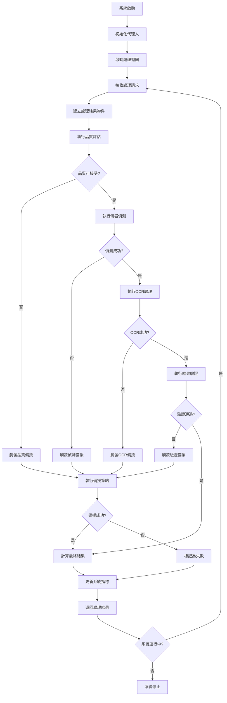

# MeterGPT Orchestrator 設計文件

## 概述

MeterGPT Orchestrator 是系統的核心協調器，負責管理所有代理人的協作流程，實作完整的儀器讀值 SOP 流程。它是整個系統的指揮中心，確保各個代理人按照正確的順序和邏輯協同工作。

## 核心職責

- **流程協調**：管理完整的儀器讀值處理流程
- **代理人管理**：初始化、監控和協調所有代理人
- **錯誤處理**：統一的錯誤處理和備援機制觸發
- **效能監控**：系統效能監控和資源管理
- **結果整合**：整合各代理人的處理結果

## 系統架構

```
┌─────────────────────────────────────────────────────────────────┐
│                MeterGPT Orchestrator                           │
├─────────────────────────────────────────────────────────────────┤
│  ┌─────────────────┐  ┌─────────────────┐  ┌─────────────────┐  │
│  │ Processing      │  │ Agent           │  │ System          │  │
│  │ Pipeline        │  │ Manager         │  │ Monitor         │  │
│  │ Controller      │  │                 │  │                 │  │
│  └─────────────────┘  └─────────────────┘  └─────────────────┘  │
│  ┌─────────────────────────────────────────────────────────────┐  │
│  │                Agent Ecosystem                             │  │
│  │  ┌─────────────┐ ┌─────────────┐ ┌─────────────────────┐   │  │
│  │  │ Stream      │ │ Quality     │ │ Detection           │   │  │
│  │  │ Manager     │ │ Assessor    │ │ Agent               │   │  │
│  │  └─────────────┘ └─────────────┘ └─────────────────────┘   │  │
│  │  ┌─────────────┐ ┌─────────────┐ ┌─────────────────────┐   │  │
│  │  │ OCR         │ │ Validation  │ │ Fallback            │   │  │
│  │  │ Agent       │ │ Agent       │ │ Agent               │   │  │
│  │  └─────────────┘ └─────────────┘ └─────────────────────┘   │  │
│  └─────────────────────────────────────────────────────────────┘  │
│  ┌─────────────────────────────────────────────────────────────┐  │
│  │              Processing Infrastructure                     │  │
│  │  ┌─────────────┐ ┌─────────────┐ ┌─────────────────────┐   │  │
│  │  │ Task Queue  │ │ Result      │ │ Performance         │   │  │
│  │  │ Manager     │ │ Aggregator  │ │ Monitor             │   │  │
│  │  └─────────────┘ └─────────────┘ └─────────────────────┘   │  │
│  └─────────────────────────────────────────────────────────────┘  │
└─────────────────────────────────────────────────────────────────┘
          │
          ▼ ProcessingResult
┌─────────────────────────────────────────────────────────────────┐
│              外部系統 (API, 資料庫, 監控系統)                     │
└─────────────────────────────────────────────────────────────────┘
```

## 核心功能

### 1. 處理流程管線 (Processing Pipeline)

**功能描述**：
- 執行完整的儀器讀值處理流程
- 管理各處理階段的順序和依賴關係
- 處理異常情況和備援機制

**處理階段**：
```python
class ProcessingStage(str, Enum):
    STREAM_CAPTURE = "stream_capture"           # 串流捕獲
    QUALITY_ASSESSMENT = "quality_assessment"   # 品質評估
    INSTRUMENT_DETECTION = "instrument_detection" # 儀器偵測
    OCR_PROCESSING = "ocr_processing"           # OCR 處理
    RESULT_VALIDATION = "result_validation"     # 結果驗證
    FALLBACK_PROCESSING = "fallback_processing" # 備援處理
    COMPLETED = "completed"                     # 完成
    FAILED = "failed"                          # 失敗
```

**處理流程**：
```python
async def _execute_processing_pipeline(self, stream_frame: StreamFrame, 
                                     result: ProcessingResult) -> ProcessingResult:
    """執行完整的處理管線"""
    current_stage = ProcessingStage.QUALITY_ASSESSMENT
    
    try:
        # 階段 1: 品質評估
        result.processing_pipeline.append(current_stage.value)
        quality_report = await self._execute_quality_assessment(stream_frame)
        result.quality_report = quality_report
        
        if not quality_report.is_acceptable:
            return await self._handle_fallback(
                stream_frame, result, FailureType.LOW_QUALITY, 
                {"quality_report": quality_report}
            )
        
        # 階段 2: 儀器偵測
        current_stage = ProcessingStage.INSTRUMENT_DETECTION
        result.processing_pipeline.append(current_stage.value)
        detection_result = await self._execute_instrument_detection(stream_frame)
        result.detection_result = detection_result
        
        if detection_result.confidence < self.config.detection_model.confidence_threshold:
            return await self._handle_fallback(
                stream_frame, result, FailureType.DETECTION_FAILED,
                {"detection_result": detection_result}
            )
        
        # 階段 3: OCR 處理
        current_stage = ProcessingStage.OCR_PROCESSING
        result.processing_pipeline.append(current_stage.value)
        ocr_results = await self._execute_ocr_processing(stream_frame, detection_result)
        result.ocr_results = ocr_results
        
        if not ocr_results or all(ocr.confidence < self.config.ocr.confidence_threshold for ocr in ocr_results):
            return await self._handle_fallback(
                stream_frame, result, FailureType.OCR_FAILED,
                {"ocr_results": ocr_results}
            )
        
        # 階段 4: 結果驗證
        current_stage = ProcessingStage.RESULT_VALIDATION
        result.processing_pipeline.append(current_stage.value)
        validation_result = await self._execute_validation(ocr_results)
        result.validation_result = validation_result
        
        if not validation_result.is_valid:
            return await self._handle_fallback(
                stream_frame, result, FailureType.VALIDATION_FAILED,
                {"validation_result": validation_result}
            )
        
        # 階段 5: 完成處理
        current_stage = ProcessingStage.COMPLETED
        result.processing_pipeline.append(current_stage.value)
        result.status = ProcessingStatus.SUCCESS
        
        # 提取最終讀值
        result.final_reading = self._extract_final_reading(ocr_results, validation_result)
        result.confidence = self._calculate_final_confidence(
            quality_report, detection_result, ocr_results, validation_result
        )
        
        return result
        
    except asyncio.TimeoutError:
        return await self._handle_fallback(
            stream_frame, result, FailureType.TIMEOUT,
            {"current_stage": current_stage.value}
        )
    except Exception as e:
        self.logger.error(f"處理管線執行失敗，當前階段: {current_stage}, 錯誤: {e}")
        result.status = ProcessingStatus.FAILED
        result.error_message = str(e)
        return result
```

### 2. 代理人管理 (Agent Management)

**功能描述**：
- 初始化和管理所有代理人實例
- 監控代理人健康狀態
- 處理代理人間的通訊和協調

**代理人初始化**：
```python
def _initialize_agents(self):
    """初始化所有代理人"""
    try:
        # 初始化各個代理人
        self.agents["stream_manager"] = StreamManager(config=self.config)
        self.agents["quality_assessor"] = QualityAssessor(config=self.config)
        self.agents["detection_agent"] = DetectionAgent(config=self.config)
        self.agents["ocr_agent"] = OCRAgent(config=self.config)
        self.agents["validation_agent"] = ValidationAgent(config=self.config)
        self.agents["fallback_agent"] = FallbackAgent(config=self.config)
        
        # 將代理人加入環境
        for agent in self.agents.values():
            self.environment.add_role(agent)
        
        self.logger.info("所有代理人初始化完成")
        
    except Exception as e:
        self.logger.error(f"代理人初始化失敗: {e}")
        raise
```

**代理人協調**：
```python
async def _coordinate_agents(self, stream_frame: StreamFrame) -> ProcessingResult:
    """協調代理人執行"""
    # 1. 品質評估
    quality_assessor = self.agents["quality_assessor"]
    quality_message = Message(content={"stream_frame": stream_frame})
    quality_response = await quality_assessor.handle(quality_message)
    
    # 2. 儀器偵測 (如果品質通過)
    if quality_response.content["quality_report"].is_acceptable:
        detection_agent = self.agents["detection_agent"]
        detection_message = Message(content={"stream_frame": stream_frame})
        detection_response = await detection_agent.handle(detection_message)
        
        # 3. OCR 處理 (如果偵測成功)
        if detection_response.content["detection_result"].confidence > 0.7:
            ocr_agent = self.agents["ocr_agent"]
            ocr_message = Message(content={
                "stream_frame": stream_frame,
                "detection_result": detection_response.content["detection_result"]
            })
            ocr_response = await ocr_agent.handle(ocr_message)
            
            # 4. 結果驗證
            validation_agent = self.agents["validation_agent"]
            validation_message = Message(content={
                "ocr_results": ocr_response.content["ocr_results"]
            })
            validation_response = await validation_agent.handle(validation_message)
            
            return self._build_processing_result(
                quality_response, detection_response, 
                ocr_response, validation_response
            )
    
    # 觸發備援機制
    return await self._trigger_fallback(stream_frame, quality_response)
```

### 3. 備援處理 (Fallback Handling)

**功能描述**：
- 統一的備援機制觸發和管理
- 根據失敗類型選擇適當的備援策略
- 整合備援處理結果

**備援處理流程**：
```python
async def _handle_fallback(self, stream_frame: StreamFrame, result: ProcessingResult,
                         failure_type: FailureType, context: Dict[str, Any]) -> ProcessingResult:
    """處理備援流程"""
    try:
        result.processing_pipeline.append(ProcessingStage.FALLBACK_PROCESSING.value)
        
        # 執行備援決策
        fallback_agent = self.agents["fallback_agent"]
        message = Message(content={
            "failure_type": failure_type,
            "context": context,
            "stream_frame": stream_frame
        })
        
        response = await fallback_agent.handle(message)
        fallback_decision = response.content["fallback_decision"]
        result.fallback_decision = fallback_decision
        
        # 根據備援決策執行相應動作
        if fallback_decision.recommended_action.value == "use_vlm":
            vlm_response = await self._execute_vlm_processing(stream_frame, context)
            result.vlm_response = vlm_response
            
            if vlm_response and vlm_response.confidence >= self.config.vlm.confidence_threshold:
                result.final_reading = vlm_response.response_text
                result.confidence = vlm_response.confidence
                result.status = ProcessingStatus.SUCCESS
            else:
                result.status = ProcessingStatus.FAILED
                result.error_message = "VLM 處理失敗或信心度不足"
        
        elif fallback_decision.recommended_action.value == "switch_camera":
            if fallback_decision.alternative_camera_id:
                result.status = ProcessingStatus.RETRY
                result.error_message = f"建議切換至攝影機: {fallback_decision.alternative_camera_id}"
            else:
                result.status = ProcessingStatus.FAILED
                result.error_message = "沒有可用的備選攝影機"
        
        elif fallback_decision.recommended_action.value == "manual_review":
            result.status = ProcessingStatus.FAILED
            result.error_message = "需要人工審核"
        
        else:
            result.status = ProcessingStatus.FAILED
            result.error_message = f"未知的備援動作: {fallback_decision.recommended_action}"
        
        return result
        
    except Exception as e:
        self.logger.error(f"備援處理失敗: {e}")
        result.status = ProcessingStatus.FAILED
        result.error_message = f"備援處理失敗: {str(e)}"
        return result
```

## 工作流程



## 資料格式

### 輸入資料格式

#### 處理請求
```python
@dataclass
class ProcessingRequest:
    camera_id: str                      # 攝影機 ID
    frame_data: bytes                   # 影像資料
    metadata: Optional[Dict[str, Any]]  # 額外元資料
    priority: int                       # 處理優先級
    timeout: float                      # 處理超時時間
    request_id: str                     # 請求識別碼
```

### 輸出資料格式

#### ProcessingResult
```python
@dataclass
class ProcessingResult:
    frame_id: str                       # 影像幀識別碼
    camera_id: str                      # 攝影機 ID
    status: ProcessingStatus            # 處理狀態
    processing_pipeline: List[str]      # 處理管線階段
    
    # 各階段結果
    quality_report: Optional[QualityReport]
    detection_result: Optional[DetectionResult]
    ocr_results: Optional[List[OCRResult]]
    validation_result: Optional[ValidationResult]
    fallback_decision: Optional[FallbackDecision]
    vlm_response: Optional[VLMResponse]
    
    # 最終結果
    final_reading: str                  # 最終讀值
    confidence: float                   # 整體信心度
    processing_time: float              # 處理時間
    error_message: Optional[str]        # 錯誤訊息
    timestamp: datetime                 # 處理時間戳
    metadata: Dict[str, Any]            # 額外元資料
```

#### SystemStatus
```python
@dataclass
class SystemStatus:
    is_running: bool                    # 系統運行狀態
    active_agents: Dict[str, bool]      # 代理人狀態
    processing_queue_size: int          # 處理佇列大小
    active_tasks: int                   # 活躍任務數
    system_metrics: Dict[str, float]    # 系統指標
    last_update: datetime               # 最後更新時間
```

## 與外部系統的整合

### 1. API 介面
```python
class MeterGPTAPI:
    def __init__(self, orchestrator: MeterGPTOrchestrator):
        self.orchestrator = orchestrator
        
    async def process_image(self, camera_id: str, image_data: bytes) -> ProcessingResult:
        """處理單一影像"""
        return await self.orchestrator.process_frame(camera_id, image_data)
    
    async def get_system_status(self) -> SystemStatus:
        """取得系統狀態"""
        return self.orchestrator.get_system_status()
    
    async def start_continuous_processing(self, camera_id: str):
        """啟動連續處理"""
        await self.orchestrator.start_continuous_processing(camera_id)
    
    async def stop_processing(self):
        """停止處理"""
        await self.orchestrator.stop_system()
```

### 2. 資料庫整合
```python
class DatabaseIntegration:
    def __init__(self, db_config: Dict[str, Any]):
        self.db_config = db_config
        self.connection_pool = None
    
    async def save_processing_result(self, result: ProcessingResult):
        """儲存處理結果"""
        async with self.connection_pool.acquire() as conn:
            await conn.execute("""
                INSERT INTO processing_results 
                (frame_id, camera_id, final_reading, confidence, processing_time, timestamp)
                VALUES ($1, $2, $3, $4, $5, $6)
            """, result.frame_id, result.camera_id, result.final_reading, 
                result.confidence, result.processing_time, result.timestamp)
    
    async def get_historical_data(self, camera_id: str, hours: int = 24) -> List[Dict]:
        """取得歷史資料"""
        async with self.connection_pool.acquire() as conn:
            rows = await conn.fetch("""
                SELECT * FROM processing_results 
                WHERE camera_id = $1 AND timestamp > NOW() - INTERVAL '%s hours'
                ORDER BY timestamp DESC
            """, camera_id, hours)
            return [dict(row) for row in rows]
```

### 3. 監控系統整合
```python
class MonitoringIntegration:
    def __init__(self, monitoring_config: Dict[str, Any]):
        self.monitoring_config = monitoring_config
        self.metrics_client = None
    
    def record_processing_metrics(self, result: ProcessingResult):
        """記錄處理指標"""
        self.metrics_client.increment('processing.total')
        
        if result.status == ProcessingStatus.SUCCESS:
            self.metrics_client.increment('processing.success')
            self.metrics_client.histogram('processing.time', result.processing_time)
            self.metrics_client.histogram('processing.confidence', result.confidence)
        else:
            self.metrics_client.increment('processing.failure')
            self.metrics_client.increment(f'processing.failure.{result.status.value}')
    
    def record_agent_metrics(self, agent_name: str, metrics: Dict[str, float]):
        """記錄代理人指標"""
        for metric_name, value in metrics.items():
            self.metrics_client.gauge(f'agent.{agent_name}.{metric_name}', value)
```

## 配置參數

### 系統配置
```yaml
system:
  # 基本設定
  config_id: "production_v1"
  environment: "production"           # development, staging, production
  log_level: "INFO"                  # DEBUG, INFO, WARNING, ERROR
  
  # 處理設定
  processing:
    queue_size: 100                  # 處理佇列大小
    max_concurrent_tasks: 10         # 最大並行任務數
    default_timeout: 30              # 預設超時時間 (秒)
    retry_attempts: 3                # 重試次數
    
  # 效能設定
  performance:
    enable_caching: true             # 啟用快取
    cache_size: 1000                # 快取大小
    gc_interval: 300                 # 垃圾回收間隔 (秒)
    memory_limit: "2GB"             # 記憶體限制
```

### 代理人配置
```yaml
agents:
  # StreamManager 配置
  stream_manager:
    enabled: true
    max_cameras: 8
    buffer_size: 10
    
  # QualityAssessor 配置
  quality_assessor:
    enabled: true
    overall_threshold: 0.6
    batch_processing: true
    
  # DetectionAgent 配置
  detection_agent:
    enabled: true
    confidence_threshold: 0.7
    max_detections: 10
    
  # OCRAgent 配置
  ocr_agent:
    enabled: true
    confidence_threshold: 0.7
    parallel_processing: true
    
  # ValidationAgent 配置
  validation_agent:
    enabled: true
    validation_threshold: 0.7
    cross_validation: true
    
  # FallbackAgent 配置
  fallback_agent:
    enabled: true
    vlm_enabled: true
    ptz_enabled: true
    manual_review_enabled: true
```

## 錯誤處理機制

### 1. 系統級錯誤處理
```python
class SystemErrorHandler:
    def __init__(self, orchestrator):
        self.orchestrator = orchestrator
        self.error_counts = {}
        self.recovery_strategies = {}
    
    async def handle_system_error(self, error: Exception, context: Dict[str, Any]):
        """處理系統級錯誤"""
        error_type = type(error).__name__
        
        # 記錄錯誤
        self.error_counts[error_type] = self.error_counts.get(error_type, 0) + 1
        
        # 選擇恢復策略
        if error_type == "MemoryError":
            await self._handle_memory_error()
        elif error_type == "ConnectionError":
            await self._handle_connection_error()
        elif error_type == "TimeoutError":
            await self._handle_timeout_error()
        else:
            await self._handle_generic_error(error, context)
    
    async def _handle_memory_error(self):
        """處理記憶體錯誤"""
        # 清理快取
        await self.orchestrator._clear_caches()
        
        # 強制垃圾回收
        import gc
        gc.collect()
        
        # 減少並行任務數
        self.orchestrator.max_concurrent_tasks = max(1, self.orchestrator.max_concurrent_tasks // 2)
```

### 2. 代理人錯誤處理
```python
async def _handle_agent_error(self, agent_name: str, error: Exception, 
                             context: Dict[str, Any]) -> bool:
    """處理代理人錯誤"""
    self.logger.error(f"代理人 {agent_name} 發生錯誤: {error}")
    
    # 嘗試重啟代理人
    try:
        await self._restart_agent(agent_name)
        return True
    except Exception as restart_error:
        self.logger.error(f"重啟代理人 {agent_name} 失敗: {restart_error}")
        
        # 標記代理人為不可用
        self.agent_status[agent_name] = False
        
        # 觸發備援機制
        await self._trigger_agent_fallback(agent_name, context)
        
        return False
```

### 3. 資源耗盡處理
```python
class ResourceManager:
    def __init__(self):
        self.resource_limits = {
            "memory": 0.8,      # 80% 記憶體使用率
            "cpu": 0.9,         # 90% CPU 使用率
            "disk": 0.9         # 90% 磁碟使用率
        }
        self.monitoring_interval = 10  # 10 秒檢查一次
    
    async def monitor_resources(self):
        """監控系統資源"""
        while True:
            try:
                # 檢查記憶體使用率
                memory_usage = self._get_memory_usage()
                if memory_usage > self.resource_limits["memory"]:
                    await self._handle_high_memory_usage()
                
                # 檢查 CPU 使用率
                cpu_usage = self._get_cpu_usage()
                if cpu_usage > self.resource_limits["cpu"]:
                    await self._handle_high_cpu_usage()
                
                # 檢查磁碟使用率
                disk_usage = self._get_disk_usage()
                if disk_usage > self.resource_limits["disk"]:
                    await self._handle_high_disk_usage()
                
                await asyncio.sleep(self.monitoring_interval)
                
            except Exception as e:
                self.logger.error(f"資源監控錯誤: {e}")
                await asyncio.sleep(self.monitoring_interval)
```

## 效能考量

### 1. 並行處理最佳化
```python
class ParallelProcessingOptimizer:
    def __init__(self, max_workers: int = 10):
        self.max_workers = max_workers
        self.semaphore = asyncio.Semaphore(max_workers)
        self.task_queue = asyncio.Queue()
        self.worker_pool = []
    
    async def process_batch(self, requests: List[ProcessingRequest]) -> List[ProcessingResult]:
        """批次處理請求"""
        # 建立工作任務
        tasks = []
        for request in requests:
            task = asyncio.create_task(self._process_with_semaphore(request))
            tasks.append(task)
        
        # 等待所有任務完成
        results = await asyncio.gather(*tasks, return_exceptions=True)
        
        # 過濾異常結果
        valid_results = []
        for result in results:
            if isinstance(result, ProcessingResult):
                valid_results.append(result)
            else:
                self.logger.error(f"處理異常: {result}")
        
        return valid_results
    
    async def _process_with_semaphore(self, request: ProcessingRequest) -> ProcessingResult:
        """使用信號量控制的處理"""
        async with self.semaphore:
            return await self._process_single_request(request)
```

### 2. 快取機制
```python
class IntelligentCache:
    def __init__(self, max_size: int = 1000):
        self.max_size = max_size
        self.cache = {}
        self.access_times = {}
        self.hit_count = 0
        self.miss_count = 0
    
    def get(self, key: str) -> Optional[Any]:
        """取得快取值"""
        if key in self.cache:
            self.access_times[key] = time.time()
            self.hit_count += 1
            return self.cache[key]
        else:
            self.miss_count += 1
            return None
    
    def put(self, key: str, value: Any):
        """設定快取值"""
        if len(self.cache) >= self.max_size:
            self._evict_lru()
        
        self.cache[key] = value
        self.access_times[key] = time.time()
    
    def _evict_lru(self):
        """移除最少使用的項目"""
        if not self.access_times:
            return
        
        lru_key = min(self.access_times.keys(), key=lambda k: self.access_times[k])
        del self.cache[lru_key]
        del self.access_times[lru_key]
    
    def get_stats(self) -> Dict[str, float]:
        """取得快取統計"""
        total_requests = self.hit_count + self.miss_count
        hit_rate = self.hit_count / total_requests if total_requests > 0 else 0.0
        
        return {
            "hit_rate": hit_rate,
            "hit_count": self.hit_count,
            "miss_count": self.miss_count,
            "cache_size": len(self.cache)
        }
```

### 3. 記憶體管理
```python
class MemoryManager:
    def __init__(self):
        self.memory_threshold = 0.8  # 80% 記憶體使用率閾值
        self.cleanup_interval = 60   # 60